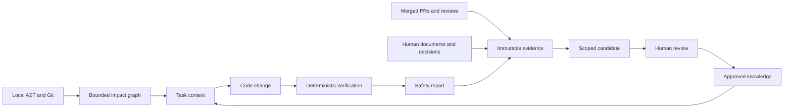
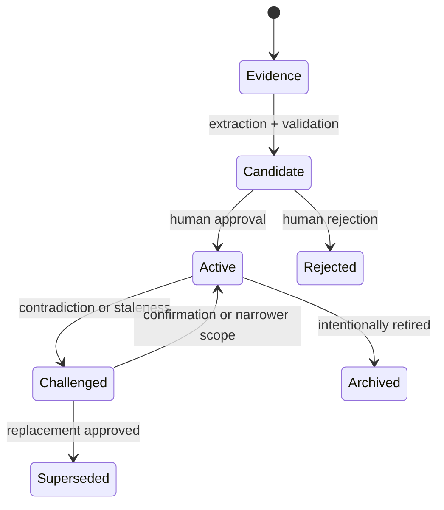
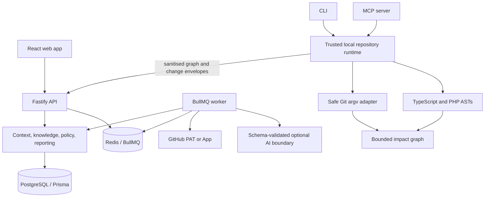

<p align="center">
  
</p>

<p align="center">
  
</p>

<h1 align="center">Evidence-backed engineering memory for people and coding agents</h1>

<p align="center">
  Lore turns code structure, Git history, merged pull requests, review feedback, documents, regressions, and human decisions into scoped context before a change—and an independent safety report afterwards.
</p>

<p align="center">
  
  
  
  
  
</p>

<p align="center">
  <a href="#one-command-demo"><strong>Run the demo</strong></a> ·
  <a href="#what-lore-does"><strong>Features</strong></a> ·
  <a href="docs/README.md"><strong>Documentation</strong></a> ·
  <a href="docs/authentication-and-organisations.md"><strong>Accounts & organisations</strong></a> ·
  <a href="docs/github.md"><strong>GitHub setup</strong></a> ·
  <a href="docs/security.md"><strong>Security</strong></a>
</p>

Lore is built around a simple rule: no knowledge gets authority merely because a model said so. Static analysis establishes structure. Git establishes history. Evidence establishes credibility. Humans establish policy. AI may propose narrowly scoped candidates, but it cannot approve itself or mutate policy directly.

## See Lore working

<p align="center">
  
</p>

The dashboard starts an evidence loop: prepare a task, inspect relevant code and history, review what Lore learned, make the change, and verify the final diff.

## One-command demo

Prerequisite: Node.js 22+ with npm.

```bash
npm run demo
```

Open [http://localhost:5173](http://localhost:5173) and choose **Explore the demo account**. The demo command installs dependencies when missing and starts realistic in-memory data. It requires no database, Redis, GitHub account, PAT, or AI key. Stop it with <kbd>Ctrl+C</kbd>.

To prove the same API and web path without leaving processes running:

```bash
npm run demo:check
```

<p align="center">
  
</p>

Try this five-minute product tour:

1. On **Dashboard**, choose **Prepare context** for the pre-filled Avalara task.
2. Inspect relevant code, affected areas, policy, evidence, tests, and the known unknown.
3. Open **Candidates** and review the statement, scope, contradictions, and confidence factors.
4. Open **Safety reports** to see how the final diff is checked against impact and history.
5. Press <kbd>⌘K</kbd> or <kbd>Ctrl+K</kbd> to navigate the product.

Demo writes reset when the API stops. Real GitHub imports and durable knowledge use persistent mode.

## The problem Lore solves

Engineering intent is usually scattered across old PRs, closed tickets, review comments, architecture notes, tests, and people’s memories. That makes deliberate behaviour look accidental, repeats old regressions, and gives coding agents a repository without its institutional context.

Lore preserves evidence-backed answers to questions such as:

- Why does this code exist?
- What else consumes this symbol or changes with it?
- Which policy, decision, or reviewer guidance applies here?
- What broke the last time this area changed?
- Which tests and reviewers are relevant?
- What remains unknown?
- What evidence supports every answer?

It stays quiet when nothing applies and specific when something does.

## What Lore does

| Feature | What it gives you | How it works |
| --- | --- | --- |
| **GitHub login and profiles** | One personal account with an editable profile initially populated from GitHub | OAuth code flow with state + PKCE, verified email, stable GitHub ID, discarded login token, and opaque revocable Lore sessions |
| **Organisations and roles** | Private workspaces, invitations, switching, and owner/admin/member/viewer access | Live membership checks, email-bound invitation acceptance, server-side selected tenant, and session rotation on organisation changes |
| **Task context** | Relevant files, symbols, impact, policy, decisions, tests, and unknowns before editing | Deterministic retrieval plus bounded graph traversal |
| **Local repository graph** | Structural and historical relationships without uploading the checkout | TypeScript/JavaScript and PHP ASTs plus bounded Git/co-change analysis |
| **GitHub memory** | Merged PRs, review bodies, inline/conversation comments, commits, paths, and patches | Fine-grained PAT or App installation, fully paginated and idempotent |
| **Knowledge registry** | Typed facts, decisions, rules, preferences, regressions, warnings, and policies | Scoped, revisioned, evidence-linked records with health and confidence |
| **Communication evidence** | Decisions and cautions from Slack, calls, meetings, email, in-person notes, and full standup transcripts | Retains provenance, extracts explicit signals, and labels new, duplicate, supporting, or conflicting suggestions for review |
| **Candidate review** | Human control over what Lore learned | Edit, narrow, change type, merge, approve, reject, or challenge with audit history |
| **Deterministic policy** | Explainable blockers and warnings | Human-owned detectors inspect changed paths and added lines—not model opinion |
| **Agent sessions** | Context and change observation around an agent run | Prepare, observe working-set expansion, refresh, and verify the terminal diff |
| **Safety reports** | An independent completion check | Git change discovery, bounded impact, policy, regressions, related tests, and unknowns |
| **Reviewer knowledge** | Relevant expertise and advisory preferences with provenance | Scoped observations with source evidence and challenge/confirmation lifecycle |
| **CLI and MCP** | Prepare/search/impact/verify inside developer and agent workflows | Local CLI authority or stdio MCP over explicit repository configuration |

The [complete feature guide](docs/features.md) includes a screenshot, usage commands, data flow, and limitations for every feature.

## Prepare context before code changes

<p align="center">
  
</p>

A context package is a bounded engineering brief, not an unfiltered history dump. It includes only scope-matching knowledge and explains why each item was selected.

```bash
lore prepare "TICKET-123 Update refund address mapping"
lore context
```

## Review what Lore learned

<p align="center">
  
</p>

Evidence can create a candidate, never automatic authority. Candidate review shows the proposed statement, type, exact repository/path/symbol scope, sources, contradictions, and every confidence factor. Approval creates an audited knowledge revision; rejection keeps the evidence without polluting active guidance.

Use **Add evidence** for context that never reached GitHub. Paste one message or an entire standup transcript; Lore retains the original source, ignores ordinary status updates, rewords explicit decisions/rules/preferences into candidates, and compares them with approved knowledge. Exact re-submissions are idempotent. The bundled local extractor makes no external AI request, and every result still requires human review. See [Ad-hoc communication evidence](docs/features.md#ad-hoc-messages-calls-and-standup-transcripts) for the privacy boundary and a complete example.

## Verify the final change

<p align="center">
  
</p>

```bash
lore verify
```

Lore discovers staged, unstaged, renamed, deleted, and untracked changes; evaluates deterministic policy; traverses affected code; checks historical regressions; and identifies related tests. Reports distinguish blockers, warnings, passes, and unknowns instead of presenting a magical “safe” score.

## How the evidence loop works



Knowledge has an explicit lifecycle:



## Use Lore in a local repository

Build and link the CLI once:

```bash
npm run build
npm link
```

Then, from a target Git repository:

```bash
lore init --repository acme/commerce --organisation acme-engineering
lore index
lore prepare "TICKET-123 task description"
lore impact AddressCode::fromRole
lore explain AddressCode::fromRole
lore verify
```

`lore init` creates owner-only `.lore/config.json`, an agent instruction file, and a local Git exclusion. `lore index` stores a local graph under `.lore/`; it never stores credentials there. In service mode it uploads only a sanitised, bounded graph envelope rather than the source checkout.

For automation, put `--json` before the command:

```bash
lore --json prepare "TICKET-123 task description"
lore --json verify
```

### Sessions and agent wrapper

```bash
lore session start "Update refund address mapping" --agent codex
lore session status
lore session stop

lore agent codex "TICKET-123 Update refund address mapping"
```

The interactive wrapper currently has one verified adapter: Codex. Other coding agents use the same deterministic boundary over MCP.

### Knowledge import and export

```bash
lore knowledge list
lore knowledge show KNOWLEDGE_UUID
lore knowledge export --format markdown --output lore-knowledge.md
lore knowledge import AGENTS.md
lore knowledge import docs/adr/0007-tax-boundary.md
```

See [onboarding](docs/onboarding.md) for the full local/service authority model and troubleshooting.

## Import GitHub history locally

For the first real import, use a fine-grained PAT restricted to selected repositories with read-only **Pull requests** and **Issues** access. Keep it in an owner-only file outside the repository:

```dotenv
DEMO_MODE=false
GITHUB_AUTH_MODE=token
GITHUB_TOKEN_PATH=/absolute/path/to/github-token
```

The worker—and only the worker—reads the credential. The browser, database, `.lore` state, and BullMQ payload never receive it. Start with 100 merged PRs, validate retention and access, then choose **All merged PRs** deliberately.

```bash
curl -X POST http://127.0.0.1:3001/api/repositories/REPOSITORY_UUID/github-import \
  -H 'content-type: application/json' \
  -d '{"limit":100}'
```

The importer paginates merged PRs, submitted review bodies, inline comments, conversation comments, commits, changed files, and available bounded patches. Use a GitHub App for installation-scoped credentials and signed live webhooks.

Follow the complete [PAT and GitHub App guide](docs/github.md), including organisation approval, SAML SSO, Docker secret mounts, callback URLs, public webhook proxies, revocation, and troubleshooting.

## Connect an agent over MCP

After `npm run build`, add the stdio server with absolute paths:

```json
{
  "mcpServers": {
    "lore": {
      "command": "node",
      "args": ["/absolute/path/to/Lore/dist/mcp.js"],
      "env": {
        "LORE_REPOSITORY_PATH": "/absolute/path/to/target/repository"
      }
    }
  }
}
```

Available tools:

- `lore_prepare_task`
- `lore_get_context`
- `lore_search`
- `lore_lookup_symbol`
- `lore_find_history`
- `lore_get_rules`
- `lore_get_decisions`
- `lore_get_impact`
- `lore_verify_change`
- `lore_explain`
- `lore_propose_knowledge`—validation only; it cannot mutate knowledge

See the [MCP guide](docs/mcp.md) for workflow and configuration details.

## Choose a runtime

| Mode | Best for | Infrastructure | Persistence |
| --- | --- | --- | --- |
| Demo | Product evaluation and screenshots | Node/npm only | Resets on API restart |
| Native local | CLI plus durable API/worker development | Local PostgreSQL and Redis | PostgreSQL |
| Docker local | Full migration, queue, API, worker, and built web stack | Docker Compose | Docker volumes |
| External SaaS | Not currently approved | P0/P1 controls not yet implemented | Do not deploy yet |

### Full local Docker stack

Prerequisite: Docker Engine with Compose v2.24+.

```bash
cp .env.example .env
# Replace SESSION_SECRET with output from: openssl rand -base64 48
npm run setup:check -- --docker
docker compose up --build
```

Compose starts PostgreSQL, Redis, migrations, seed data, API, worker, and the production-built web app. Open [http://localhost:5173](http://localhost:5173).

```bash
docker compose ps
curl http://127.0.0.1:3001/healthz
curl http://127.0.0.1:3001/readyz
```

### Native persistent stack

Run PostgreSQL and Redis, then set `DEMO_MODE=false`, the two connection URLs, `LOCAL_DEV_AUTH=true`, and the seeded IDs described in [onboarding](docs/onboarding.md).

```bash
npm run db:migrate
npm run seed
npm run setup:check
npm run dev
```

Run `npm run worker` in a second terminal for queued indexing, GitHub import, extraction, and health jobs.

### Environment reference

Copy [`.env.example`](.env.example) and change only the mode you need. `npm run setup:check` reports missing or unsafe configuration without printing credential contents.

| Group | Variables | Notes |
| --- | --- | --- |
| Runtime | `NODE_ENV`, `DEMO_MODE`, `API_PORT`, `API_HOST`, `APP_URL`, `WEB_ORIGIN`, `LOG_LEVEL` | Keep `APP_URL` loopback while using bundled local auth. |
| Storage/jobs | `DATABASE_URL`, `REDIS_URL`, `WORKER_CONCURRENCY` | Required only for persistent mode; lower concurrency for an initial very large import. |
| GitHub login | `SESSION_SECRET`, `AUTH_SESSION_TTL_HOURS`, `GITHUB_OAUTH_CLIENT_ID`, `GITHUB_OAUTH_CLIENT_SECRET`, `GITHUB_OAUTH_CALLBACK_URL` | Personal identity and profiles; see [account setup](docs/authentication-and-organisations.md). |
| Local identity bypass | `LOCAL_DEV_AUTH`, `LOCAL_ORGANISATION_ID`, `LOCAL_USER_ID`, `LOCAL_USER_NAME` | Loopback development only; never enable in shared environments. |
| Server checkout access | `LORE_ALLOWED_REPOSITORY_ROOTS` | Prefer local `lore index` graph upload and leave this empty. |
| GitHub PAT | `GITHUB_AUTH_MODE`, `GITHUB_TOKEN`, `GITHUB_TOKEN_PATH`, `GITHUB_TOKEN_FILE` | Prefer an owner-only token file; `_FILE` is the Docker host mount source. |
| GitHub App | `GITHUB_APP_ID`, `GITHUB_APP_SLUG`, `GITHUB_PRIVATE_KEY_PATH`, `GITHUB_PRIVATE_KEY_FILE`, `GITHUB_PRIVATE_KEY`, `GITHUB_WEBHOOK_SECRET` | Needed for installation credentials and signed live webhooks. |
| AI | `AI_PROVIDER`, `OPENAI_API_KEY`, `OPENAI_MODEL` | `mock` is the only bundled adapter; `OPENAI_*` is reserved and not consumed. |
| Encryption | `ENCRYPTION_KEY` | Reserved for a future production envelope-encryption boundary and not consumed by this prototype. |

Native paths such as `GITHUB_TOKEN_PATH` must be absolute; dotenv does not expand `$HOME`. Docker host paths use the corresponding `*_FILE` variable and the documented Compose overlay.

## Architecture

Lore is a strict-TypeScript modular monolith with explicit adapter boundaries. It can run on one machine while preserving the seams needed for a future customer-managed node and separate control plane.



Key guarantees:

- PostgreSQL is the durable source of truth in persistent mode.
- Local checkout paths are never selected by the browser.
- Every knowledge item retains scope, evidence, confidence, classification, health, and provenance.
- Model output is schema-validated and remains a proposal or candidate.
- Policies are explicit, human-owned, and deterministic.
- Impact traversal has confidence, depth, and node limits.
- Persistent access is organisation-scoped and provider events route from trusted repository identity.

Read [architecture](docs/architecture.md), [knowledge model](docs/knowledge-model.md), and [impact engine](docs/impact-engine.md).

## Security and responsible deployment

Implemented boundaries include opaque hashed and revocable server sessions, GitHub OAuth state and PKCE, verified-email identity linking, session rotation, signed HTTP-only cookies, CSRF protection for non-demo production writes, live organisation membership and baseline role checks, email-bound invitations, webhook HMAC validation, immutable provider IDs, structured log redaction, safe Git argument arrays, owner-only local state, and deterministic policy detectors.

Repository text, tickets, reviews, documents, and model output are always untrusted. AI cannot create policy, calculate authority, execute tools, or write database rows directly.

This repository is a comprehensive local prototype—not an approved external multi-tenant SaaS service. Before processing customer or regulated data, read:

- [Security model](docs/security.md)
- [Authentication, profiles, organisations, and roles](docs/authentication-and-organisations.md)
- [AI safety](docs/ai-safety.md)
- [SaaS, enterprise, privacy, PCI, and AI-governance readiness](docs/saas-readiness.md)

The SaaS plan explicitly tracks production identity, tenant isolation, managed secrets/KMS, DLP before persistence, deletion/backup propagation, incident response, DPIA/DPA, PCI scope assessment, AI provider controls, penetration testing, and evidence-based go-live gates.

## Documentation

| If you want to… | Start here |
| --- | --- |
| Run a guided product tour | [Documentation home](docs/README.md) |
| Understand every feature with screenshots | [Feature guide](docs/features.md) |
| Set up a checkout, CLI, service, or agent | [Onboarding](docs/onboarding.md) |
| Configure a PAT or GitHub App | [GitHub integration](docs/github.md) |
| Understand internals and trust boundaries | [Architecture](docs/architecture.md) |
| Understand evidence, confidence, and lifecycle | [Knowledge model](docs/knowledge-model.md) |
| Understand graph traversal and impact | [Impact engine](docs/impact-engine.md) |
| Connect MCP | [MCP guide](docs/mcp.md) |
| Develop, test, or operate the repository | [Development](docs/development.md) · [API](docs/api.md) |
| Review security and model boundaries | [Security](docs/security.md) · [AI safety](docs/ai-safety.md) |
| Evaluate an external deployment | [SaaS readiness](docs/saas-readiness.md) |
| See exactly what is executable today | [Capability inventory](docs/capabilities.md) |
| Review the checked `.ideas2` delivery plan | [Compatibility roadmap](docs/roadmap.md) |
| Reuse the visual and verbal system | [Brand guide](docs/brand.md) |

## Development and verification

```bash
npm run demo:check   # Prove the zero-infrastructure demo path
npm run setup:check  # Secret-safe environment diagnosis
npm run typecheck
npm run lint
npm test
npm run test:coverage
npm run build
```

Additional commands:

```bash
npm run dev          # API + Vite web app
npm run worker       # BullMQ worker
npm run mcp          # stdio MCP server
npm run cli -- help  # unlinked CLI
npm run db:migrate
npm run db:seed
```

Tests use `tests/fixtures/demo-repo` and never require a live GitHub account or real AI request.

## Repository map

```text
apps/api       Fastify HTTP boundary, auth, readiness, metrics, static production host
apps/worker    queued indexing, GitHub import, extraction, and health evaluation
apps/cli       local developer workflow and verified agent wrapper
apps/mcp       deterministic stdio tools for coding agents
apps/web       responsive React operations and review UI
packages/*     composable domain services and adapters
prisma         PostgreSQL schema, migrations, and idempotent demo seed
prompts        versioned, schema-constrained prompt contracts
tests          unit, integration, webhook, fixture, and vertical-slice tests
docs           product, setup, architecture, security, and governance guides
```

## Current status and roadmap

The local vertical slice is runnable today: demo UI, local AST/Git indexing, context preparation, knowledge lifecycle, policies, sessions, verification, PAT/App GitHub history, queue workers, CLI, MCP, and PostgreSQL storage.

The next implementation slice is a shared memory/PostgreSQL store-conformance suite plus idempotent lifecycle writes. First-class change-observation/report provenance now exists; durable job/outbox state, source/evidence revisions, and production identity follow it. The full, conflict-checked sequence is in the [`.ideas2` compatibility roadmap](docs/roadmap.md). External deployment gates are tracked separately in [SaaS readiness](docs/saas-readiness.md) and must not be marketed as completed.

## Brand

Lore should feel like a calm technical archive: precise, evidence-led, quietly confident, and honest about uncertainty. The layered mark represents an open book, repository strata, and the provenance layers beneath every decision. The complete asset, palette, voice, screenshot, and usage rules are in the [brand guide](docs/brand.md).

---

<p align="center"><strong>Lore remembers why—then shows the evidence.</strong></p>
