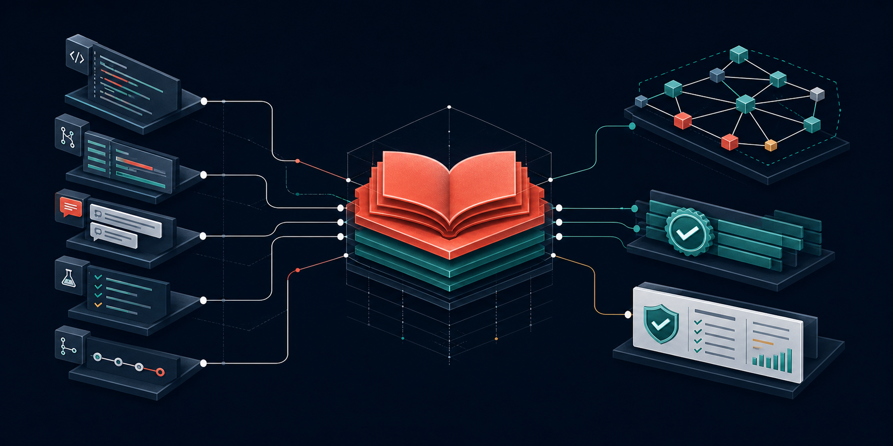
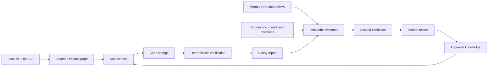
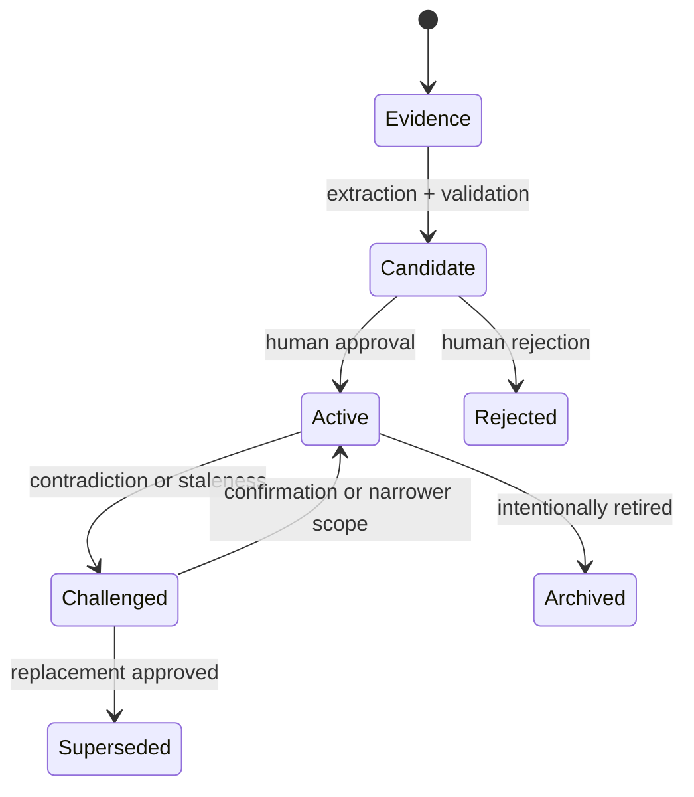
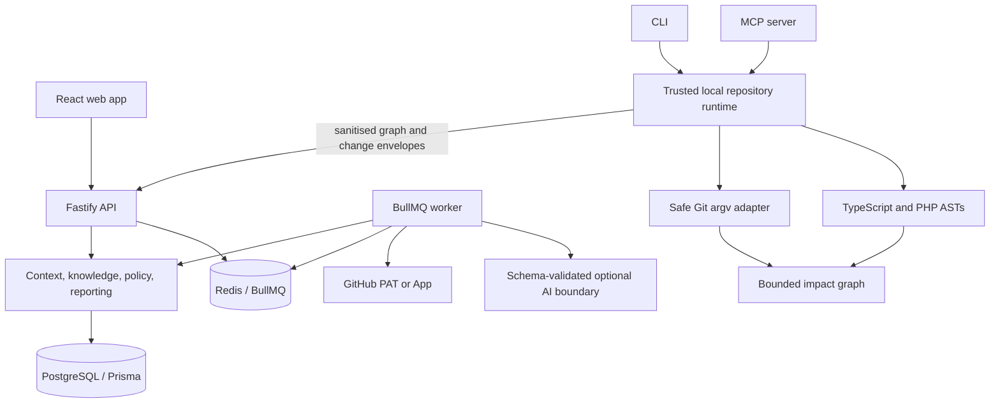

<p align="center">
  
</p>

<p align="center">
  
</p>

<h1 align="center">Evidence-backed engineering memory for people and coding agents</h1>

<p align="center">
  Lore turns code structure, Git history, merged pull requests, review feedback, documents, regressions, and human decisions into scoped context before a change—and an independent safety report afterwards.
</p>

<p align="center">
  
  
  
  
  
</p>

<p align="center">
  <a href="#one-command-demo"><strong>Run the demo</strong></a> ·
  <a href="#what-lore-does"><strong>Features</strong></a> ·
  <a href="docs/README.md"><strong>Documentation</strong></a> ·
  <a href="docs/authentication-and-organisations.md"><strong>Accounts & organisations</strong></a> ·
  <a href="docs/github.md"><strong>GitHub setup</strong></a> ·
  <a href="docs/security.md"><strong>Security</strong></a>
</p>

Lore is built around a simple rule: no knowledge gets authority merely because a model said so. Static analysis establishes structure. Git establishes history. Evidence establishes credibility. Humans establish policy. AI may propose narrowly scoped candidates, but it cannot approve itself or mutate policy directly.

## Full local install

With Docker running, use the guided one-command setup:

```bash
npm run local
```

The command securely prompts for the one PAT when it is not configured, preserves your existing OpenAI key, generates the session secret, verifies both providers, builds, migrates, and starts Lore. Open [http://localhost:5173](http://localhost:5173). One `GITHUB_TOKEN` supplies your local GitHub profile, the token-backed repository picker, and read-only PR evidence. No OAuth callback, GitHub App, private key, token file, installation ID, or fixed local user/organisation ID is required. PostgreSQL and Redis persist everything, and `npm run local:install` makes Lore start at macOS login. Follow the [complete local guide](docs/local-production.md).

## See Lore working

Unauthenticated visitors start on Lore's public product page. It explains the evidence-to-knowledge workflow, GitHub and communication ingestion, human approval boundary, task context, safety reports, local-first operation, and the path to governed team deployment. **Explore Lore** opens the focused sign-in screen; an authenticated local user enters the workspace directly.

<p align="center">
  
</p>

<p align="center">
  
</p>

The dashboard starts an evidence loop: prepare a task, inspect relevant code and history, review what Lore learned, make the change, and verify the final diff.

## One-command demo

Prerequisite: Node.js 22+ with npm.

```bash
npm run demo
```

Open [http://localhost:5173](http://localhost:5173), choose **Explore Lore**, then **Explore the demo account**. The demo command installs dependencies when missing and starts realistic in-memory data. It requires no database, Redis, GitHub account, PAT, or AI key. Stop it with <kbd>Ctrl+C</kbd>.

To prove the same API and web path without leaving processes running:

```bash
npm run demo:check
```

<p align="center">
  
</p>

Try this five-minute product tour:

1. On **Dashboard**, choose **Prepare context** for the pre-filled Avalara task.
2. Inspect relevant code, affected areas, policy, evidence, tests, and the known unknown.
3. Open **Candidates** and review the statement, scope, contradictions, and confidence factors.
4. Open **Safety reports** to see how the final diff is checked against impact and history.
5. Press <kbd>⌘K</kbd> or <kbd>Ctrl+K</kbd> to navigate the product.

Demo writes reset when the API stops. Real GitHub imports and durable knowledge use persistent mode.

## The problem Lore solves

Engineering intent is usually scattered across old PRs, closed tickets, review comments, architecture notes, tests, and people’s memories. That makes deliberate behaviour look accidental, repeats old regressions, and gives coding agents a repository without its institutional context.

Lore preserves evidence-backed answers to questions such as:

- Why does this code exist?
- What else consumes this symbol or changes with it?
- Which policy, decision, or reviewer guidance applies here?
- What broke the last time this area changed?
- Which tests and reviewers are relevant?
- What remains unknown?
- What evidence supports every answer?

It stays quiet when nothing applies and specific when something does.

## What Lore does

| Feature | What it gives you | How it works |
| --- | --- | --- |
| **GitHub identity and profiles** | One personal account with an editable profile initially populated from GitHub | One PAT in loopback-only local mode; OAuth code flow and revocable Lore sessions in shared/SaaS mode |
| **Organisations and roles** | Private workspaces, invitations, switching, and owner/admin/member/viewer access | Live membership checks, email-bound invitation acceptance, server-side selected tenant, and session rotation on organisation changes |
| **Task context** | Relevant files, symbols, impact, policy, decisions, tests, and unknowns before editing | Deterministic retrieval plus bounded graph traversal |
| **Local repository graph** | Structural and historical relationships without uploading the checkout | TypeScript/JavaScript and PHP ASTs plus bounded Git/co-change analysis |
| **GitHub memory** | Automatic merged PRs, review bodies, inline/conversation comments, commits, paths, and optional patches | Token-backed repository discovery, complete initial pagination, recurring sync, immutable source revisions, and new-or-edited-evidence extraction |
| **Knowledge registry** | Typed facts, decisions, rules, preferences, regressions, warnings, and policies | Scoped, revisioned, evidence-linked records with health and confidence |
| **Communication evidence** | Decisions and cautions from Slack, calls, meetings, email, in-person notes, and full standup transcripts | Retains provenance, extracts explicit signals, and labels new, duplicate, supporting, or conflicting suggestions for review |
| **Candidate review** | Human control over what Lore learned | Edit, narrow, change type, merge, approve, reject, or challenge with audit history |
| **Deterministic policy** | Explainable blockers and warnings | Human-owned detectors inspect changed paths and added lines—not model opinion |
| **Agent sessions** | Context and change observation around an agent run | Prepare, observe working-set expansion, refresh, and verify the terminal diff |
| **Durable background activity** | Visible imports, indexing, AI extraction, retries, failures, and outcomes | PostgreSQL job ledger and outbox, Redis transport, worker lifecycle events, and automatic reconciliation |
| **Safety reports** | An independent completion check | Git change discovery, bounded impact, policy, regressions, related tests, and unknowns |
| **Reviewer knowledge** | Relevant expertise and advisory preferences with provenance | Scoped observations with source evidence and challenge/confirmation lifecycle |
| **CLI and MCP** | Prepare/search/impact/verify inside developer and agent workflows | Local CLI authority or stdio MCP over explicit repository configuration |

The [complete feature guide](docs/features.md) includes a screenshot, usage commands, data flow, and limitations for every feature.

## Prepare context before code changes

<p align="center">
  
</p>

A context package is a bounded engineering brief, not an unfiltered history dump. It includes only scope-matching knowledge and explains why each item was selected.

```bash
lore prepare "TICKET-123 Update refund address mapping"
lore context
```

## Review what Lore learned

<p align="center">
  
</p>

Evidence can create a candidate, never automatic authority. Candidate review shows the proposed statement, type, exact repository/path/symbol scope, sources, contradictions, and every confidence factor. Approval creates an audited knowledge revision; rejection keeps the evidence without polluting active guidance.

Use **Add evidence** for context that never reached GitHub. Paste one message or an entire standup transcript; Lore retains the original source, ignores ordinary status updates, rewords explicit decisions/rules/preferences into candidates, and compares them with approved knowledge. Exact re-submissions are idempotent. Full local mode uses the configured schema-validated OpenAI provider; every result still requires human review. See [Ad-hoc communication evidence](docs/features.md#ad-hoc-messages-calls-and-standup-transcripts) for the privacy boundary and a complete example.

## Verify the final change

<p align="center">
  
</p>

```bash
lore verify
```

Lore discovers staged, unstaged, renamed, deleted, and untracked changes; evaluates deterministic policy; traverses affected code; checks historical regressions; and identifies related tests. Reports distinguish blockers, warnings, passes, and unknowns instead of presenting a magical “safe” score.

## How the evidence loop works



Knowledge has an explicit lifecycle:



## Use Lore in a local repository

Build and link the CLI once:

```bash
npm run build
npm link
```

Then, from a target Git repository:

```bash
lore init --repository acme/commerce --organisation acme-engineering
lore index
lore prepare "TICKET-123 task description"
lore impact AddressCode::fromRole
lore explain AddressCode::fromRole
lore verify
```

`lore init` creates owner-only `.lore/config.json`, an agent instruction file, and a local Git exclusion. `lore index` stores a local graph under `.lore/`; it never stores credentials there. In service mode it uploads only a sanitised, bounded graph envelope rather than the source checkout.

For automation, put `--json` before the command:

```bash
lore --json prepare "TICKET-123 task description"
lore --json verify
```

### Sessions and agent wrapper

```bash
lore session start "Update refund address mapping" --agent codex
lore session status
lore session stop

lore agent codex "TICKET-123 Update refund address mapping"
```

The interactive wrapper currently has one verified adapter: Codex. Other coding agents use the same deterministic boundary over MCP.

### Knowledge import and export

```bash
lore knowledge list
lore knowledge show KNOWLEDGE_UUID
lore knowledge export --format markdown --output lore-knowledge.md
lore knowledge import AGENTS.md
lore knowledge import docs/adr/0007-tax-boundary.md
```

See [onboarding](docs/onboarding.md) for the full local/service authority model and troubleshooting.

## Import GitHub history locally

For a full local install, add one PAT to the owner-only `.env` file:

```dotenv
GITHUB_TOKEN=github_pat_...
```

Repository selection is application data, not environment configuration. Open **Repositories → Connect repositories**, search the complete token-visible list, select one or many repositories, and connect them to the active Lore organisation. Repeat for additional organisations or for accounts with more than 500 results in one selection.

To diagnose GitHub permissions for one repository without changing Lore, run the optional check:

```bash
npm run github:check -- OWNER/REPOSITORY
```

The API uses the token to refresh your local GitHub profile and list every repository it can read; the worker uses it for history. The browser, database, `.lore` state, and BullMQ payload never receive it. Each newly connected repository immediately queues the organisation’s initial import—**all merged PRs** by default—plus an hourly latest-history sync. Duplicate or already-connected selections are skipped safely.

The importer paginates merged PRs, submitted review bodies, inline comments, conversation comments, commits, changed files, and available bounded patches. A GitHub App is only for a future shared/SaaS deployment that needs installation-scoped credentials and signed live webhooks.

Follow the [GitHub guide](docs/github.md) for classic versus fine-grained PAT reach, organisation approval, GitHub SAML SSO, automatic evidence details, SaaS GitHub Apps, revocation, and troubleshooting.

## Connect an agent over MCP

After `npm run build`, add the stdio server with absolute paths:

```json
{
  "mcpServers": {
    "lore": {
      "command": "node",
      "args": ["/absolute/path/to/Lore/dist/mcp.js"],
      "env": {
        "LORE_REPOSITORY_PATH": "/absolute/path/to/target/repository"
      }
    }
  }
}
```

Available tools:

- `lore_prepare_task`
- `lore_get_context`
- `lore_search`
- `lore_lookup_symbol`
- `lore_find_history`
- `lore_get_rules`
- `lore_get_decisions`
- `lore_get_impact`
- `lore_verify_change`
- `lore_explain`
- `lore_propose_knowledge`—validation only; it cannot mutate knowledge

For the easiest local setup, connect a checkout without IDs or another token:

```bash
cd /absolute/path/to/checkout
node /Users/dev/Lore/dist/cli.js connect OWNER/REPOSITORY
node /Users/dev/Lore/dist/cli.js index

cd /Users/dev/Lore
npm run mcp:check -- /absolute/path/to/checkout
```

See the [MCP guide](docs/mcp.md) for Codex/Claude/Cursor configuration and the copyable agent setup prompt.

## Choose a runtime

| Mode | Best for | Infrastructure | Persistence |
| --- | --- | --- | --- |
| Demo | Product evaluation and screenshots | Node/npm only | Resets on API restart |
| Native local | API/worker development with one PAT identity | Local PostgreSQL and Redis | PostgreSQL + Redis |
| Docker local | Complete everyday product, AI, MCP, auto-sync, and built web stack | Docker Compose | PostgreSQL + Redis volumes |
| External SaaS | Not currently approved | P0/P1 controls not yet implemented | Do not deploy yet |

### Full local Docker stack

Prerequisite: Docker Engine with Compose v2.24+. This is the recommended everyday installation: one GitHub PAT, real OpenAI extraction, PostgreSQL, persistent Redis, migrations, worker jobs, and production-built web assets.

```bash
npm run local
```

That guided command asks for the PAT without echoing it. If `OPENAI_API_KEY` is already in `.env`, it is preserved. Use `npm run local:setup` followed by `npm run local:up` only when you deliberately want separate configuration and startup steps.

Normal starts do not seed demo data. All published services bind to loopback. Open [http://localhost:5173](http://localhost:5173).

```bash
npm run local:check
npm run local:logs
npm run local:backup
npm run local:install
npm run local:down
```

For repository discovery, automatic crawl, AI/MCP proof, persistence, backup, and boot setup, follow [Full local installation](docs/local-production.md).

### Native persistent stack

Run PostgreSQL and Redis, then set `LORE_DEPLOYMENT_MODE=local`, the two connection URLs, and `GITHUB_TOKEN`. Persistent product mode is the default; the same token-backed local identity is used and there is no fixed-ID or repository-name bypass. `DEMO_MODE=true` is accepted only with `NODE_ENV=development` for explicit fixture work.

```bash
npm run db:migrate
npm run setup:check
npm run dev
```

Run `npm run worker` in a second terminal for queued indexing, GitHub import, extraction, and health jobs.

### Environment reference

Copy [`.env.example`](.env.example) for local use. Shared deployment variables live separately in [`.env.saas.example`](.env.saas.example). `npm run setup:check` reports missing configuration without printing credentials.

| Group | Variables | Notes |
| --- | --- | --- |
| Runtime | `LORE_DEPLOYMENT_MODE`, `NODE_ENV`, `API_PORT`, `API_HOST`, `APP_URL`, `WEB_ORIGIN`, `TRUST_PROXY`, `LOG_LEVEL` | Local product mode is persistent by default. `npm run demo` injects the development-only `DEMO_MODE=true`; do not put it in an everyday local installation. The API defaults to host loopback. |
| Storage/jobs | `DATABASE_URL`, `REDIS_URL`, `WORKER_CONCURRENCY`, `WORKER_MAX_STALLED_COUNT` | Required only for persistent mode; lower concurrency for an initial very large import. The stalled allowance defaults to 10 so ordinary local restarts do not discard a long crawl. |
| Local identity and GitHub | `GITHUB_TOKEN` | The only required local GitHub credential; supplies profile, unrestricted token-visible repository discovery, and history. Repository selection is stored per organisation in the app. |
| GitHub crawler safety | `GITHUB_REQUESTS_PER_HOUR` (optional) | Defaults to 1,000/hour, or one serial request every 3.6 seconds. GitHub response headers can only slow this further; the final 10% of reported quota is reserved. |
| Local session | `SESSION_SECRET`, `AUTH_SESSION_TTL_HOURS` | `local:setup` generates the secret. Multiple local organisations and roles remain supported. |
| Server checkout access | `LORE_ALLOWED_REPOSITORY_ROOTS` | Prefer local `lore index` graph upload and leave this empty. |
| AI | `AI_PROVIDER`, `OPENAI_API_KEY`, `OPENAI_MODEL`, optional `LORE_AI_PREFLIGHT` | Real OpenAI Responses API adapter with strict structured output; local default model is `gpt-4.1-mini`. |
| SaaS-only public boundary | OAuth, GitHub App, and optional `LORE_ALLOWED_HOSTS` variables in `.env.saas.example` | Required only for remote multi-user identity, installations, signed webhooks, and additional proxy/API hostnames. |
| SaaS encryption | `ENCRYPTION_KEY` | External deployment gate for managed envelope encryption; not needed by loopback local mode. |

You can delete blank OAuth, App, PEM, token-file, and local-ID lines from an old local `.env`; Lore does not need them.

### Setup issues found and resolved

The full local path was exercised while it was being built. These were the concrete setup failures found and fixed:

| Problem encountered | Resolution now in the project |
| --- | --- |
| Local GitHub setup exposed OAuth callbacks, App keys, token files, and fixed user/organisation IDs | `.env.example` now uses one `GITHUB_TOKEN`; advanced shared settings live in `.env.saas.example`. |
| Full local setup still required manually editing `.env` before the first start | `npm run local` now prompts for the one PAT without echoing it, preserves existing secrets, performs preflights, and starts the persistent stack. |
| A configured OpenAI key could still leave the mock provider selected | `local:setup` selects `AI_PROVIDER=openai`, and `ai:check` makes one schema-validated live request. |
| Repository use was framed around an environment-defined evaluation target | Repository names no longer belong in `.env`; the organisation-scoped app picker searches every token-visible repository and connects up to 500 at a time. |
| Missing runtime configuration could silently produce an in-memory product | Persistent PostgreSQL/Redis operation is now the default and fails closed; fixtures require the explicit development-only `npm run demo` path and are rejected in production. |
| Repository connection required manual imports and recurring jobs could reprocess old evidence | Connect now queues the organisation's initial import, installs its sync schedule, and extracts only newly stored evidence. |
| MCP could look configured without proving the service boundary | `mcp:check` performs a real stdio handshake, checks all advertised tools, and calls service-backed search. |
| Redis jobs were not durable and there was no workstation startup path | Redis AOF plus a named volume, backups, and the macOS login service are included. |
| A Redis outage between an API request and queue dispatch could make background work disappear | PostgreSQL now records the job and outbox intent first; reconciliation retries dispatch after Redis or the API restarts, and **Activity** exposes every lifecycle state. |
| Native API/worker commands did not consume the documented `.env` file | Both native entrypoints now load `.env`; Docker continues to inject the same settings through Compose. |
| The demo could inherit real provider credentials from the shell or `.env` | The demo now explicitly disables GitHub access and forces the deterministic mock AI provider. |
| Some macOS Docker installations referenced an unavailable credential helper | Local scripts create a temporary isolated Docker client config while preserving the active daemon/context. |
| Slim container builds could miss the OpenSSL runtime Prisma expects | Production images install the required runtime package before generation and startup. |
| A real, mature checkout produced an 18 MB sanitised graph, but the API inherited the 2.5 MB limit intended for ordinary requests and the CLI only reported “The request was rejected” | The analysis route now has its own bounded 50 MB allowance while every other endpoint keeps the smaller global limit; oversized graphs receive an actionable error. |
| The local startup check still expected an empty React root after the SEO fallback content was added | Readiness now recognises the built root element with or without fallback children, so a healthy production stack no longer waits for two minutes and fails. |
| A GitHub rate-limit outage after restart blocked local CLI graph uploads because the API re-fetched `/user` before every local session | Local mode now binds a one-way fingerprint of the PAT to the persisted GitHub account; restarts and local-only operations reuse that identity without spending GitHub quota, with a single-account upgrade fallback for existing installations. |
| Historical imports fetched five PR detail collections concurrently and retried a depleted GitHub quota after seconds | Worker requests are now serialised behind a shared 1,000/hour safety budget, slow further from GitHub's remaining/reset headers, preserve quota headroom, and wait through primary or secondary limits before continuing. |
| An hourly sync could begin while a full-history crawl was still active, duplicating GitHub requests | Repository-scoped worker locks and API active-job detection now allow one crawl per repository; overlapping syncs finish as safely skipped and Activity retains the outcome. |
| OpenAI rejected candidate extraction because optional scope fields are forbidden by strict Structured Outputs | Lore now sends every scope key as required and nullable, compacts nulls after validation, batches large evidence sets, and lets **Extract evidence** replay PostgreSQL records without re-crawling GitHub. |
| A repository reported tens of thousands of indexed entities and relationships but exposed no usable graph view | **Repositories → Browse graph** now provides server-paginated entity search, type filters, enriched relationship search, related-entity focus, and bounded paging. |
| Long or minified JavaScript calls truncated exactly after a dot produced seven blank placeholder names in the Soho Home graph, while the CLI hid the schema paths | The analyzer now derives a non-empty final call segment, and CLI validation errors include bounded issue paths and messages without echoing source content. |
| Atomically replacing the real Soho Home graph exceeded Prisma's default five-second interactive transaction timeout | Entity and relationship writes are now performed in bounded 5,000-row batches inside the same atomic transaction, with a route-specific two-minute persistence timeout for large validated graphs. |
| Rebuilding the API left the long-running nginx container pinned to the retired container IP, making the browser report `Lore API returned 502` while the direct API remained healthy | nginx now re-resolves the Compose `api` service through Docker DNS every five seconds, startup checks the proxied path, and the production error screen points to `local:check`/`local:start` instead of development mode. |
| A 2 GiB Colima VM could be exhausted when the Docker build also assigned the compiler a 2 GiB heap | The container compiler is bounded to a 1 GiB heap; runtime containers retain Node's normal limits. |
| Rebuilding while the whole application was running still exhausted a 2 GiB Colima VM | `npm run local:up` now temporarily stops the containers before compiling, then recreates them against the same named PostgreSQL and Redis volumes. No stored data is removed. `local:start` remains the fast path that restarts existing images; `local:up` rebuilds changed code. |
| Creating a second organisation worked, but switching back was rejected and the UI gave no explanation | The signed CSRF secret cookie had inherited `/api/auth/` as its browser path, so it was absent from the organisation endpoint. It now uses `Path=/`, organisation switching is covered end to end, and both switch surfaces show failures instead of swallowing them. |
| A stopped worker could leave PostgreSQL jobs marked `running`, blocking a replacement import after BullMQ had already failed it | Worker startup now reconciles terminal/missing transport jobs, scheduled retries reuse their existing durable run, and transport-level stalls are recorded even when they occur outside the processor callback. |
| A rate-limited full-history crawl held completed PRs in memory until the entire repository finished | Every completed PR is now persisted and sent to extraction immediately. Its GitHub update version becomes a durable per-PR checkpoint, so restarts skip unchanged expensive detail collections while retaining edited-evidence detection. |
| CLI/MCP config recorded an organisation but local requests always used the account's first workspace | Service requests now carry the configured organisation; local PAT identity validates current membership before selecting it, allowing separate checkouts to target separate organisations. |
| The evidence-revision backfill used an ambiguous joined column and an interrupted PostgreSQL migration retained earlier DDL | The migration qualifies the current hash and is safely replayable with guarded DDL/backfill, then exercised against the composed PostgreSQL service. |

Preflight intentionally refuses to start full local mode until a real `GITHUB_TOKEN` is present. After adding it, choose repositories in the application; use `npm run github:check -- OWNER/REPOSITORY` only when diagnosing access to a specific repository.

## Architecture

Lore is a strict-TypeScript modular monolith with explicit adapter boundaries. It can run on one machine while preserving the seams needed for a future customer-managed node and separate control plane.



Key guarantees:

- PostgreSQL is the durable source of truth in persistent mode.
- Local checkout paths are never selected by the browser.
- Every knowledge item retains scope, evidence, confidence, classification, health, and provenance.
- Model output is schema-validated and remains a proposal or candidate.
- Policies are explicit, human-owned, and deterministic.
- Impact traversal has confidence, depth, and node limits.
- Persistent access is organisation-scoped and provider events route from trusted repository identity.

Read [architecture](docs/architecture.md), [knowledge model](docs/knowledge-model.md), and [impact engine](docs/impact-engine.md).

## Security and responsible deployment

Implemented boundaries include loopback-only single-token local identity, loopback-default server binding, exact production Host/Origin validation, OAuth/state/PKCE and hashed revocable sessions for shared mode, live organisation membership and roles, scoped/revocable SaaS agent tokens, CSRF protection, email-bound invitations, webhook HMAC validation, immutable provider IDs, structured log redaction, safe Git argument arrays, owner-only local state, and deterministic policy detectors.

Repository text, tickets, reviews, documents, and model output are always untrusted. AI cannot create policy, calculate authority, execute tools, or write database rows directly.

This repository is a comprehensive local prototype—not an approved external multi-tenant SaaS service. Before processing customer or regulated data, read:

- [Security model](docs/security.md)
- [Authentication, profiles, organisations, and roles](docs/authentication-and-organisations.md)
- [AI safety](docs/ai-safety.md)
- [SaaS, enterprise, privacy, PCI, and AI-governance readiness](docs/saas-readiness.md)

The SaaS plan explicitly tracks production identity, tenant isolation, managed secrets/KMS, DLP before persistence, deletion/backup propagation, incident response, DPIA/DPA, PCI scope assessment, AI provider controls, penetration testing, and evidence-based go-live gates.

## Documentation

| If you want to… | Start here |
| --- | --- |
| Run a guided product tour | [Documentation home](docs/README.md) |
| Understand every feature with screenshots | [Feature guide](docs/features.md) |
| Set up a checkout, CLI, service, or agent | [Onboarding](docs/onboarding.md) |
| Configure a PAT or GitHub App | [GitHub integration](docs/github.md) |
| Understand internals and trust boundaries | [Architecture](docs/architecture.md) |
| Understand evidence, confidence, and lifecycle | [Knowledge model](docs/knowledge-model.md) |
| Understand graph traversal and impact | [Impact engine](docs/impact-engine.md) |
| Connect MCP | [MCP guide](docs/mcp.md) |
| Develop, test, or operate the repository | [Development](docs/development.md) · [API](docs/api.md) |
| Review security and model boundaries | [Security](docs/security.md) · [AI safety](docs/ai-safety.md) |
| Evaluate an external deployment | [SaaS readiness](docs/saas-readiness.md) |
| See exactly what is executable today | [Capability inventory](docs/capabilities.md) |
| Review the checked `.ideas2` delivery plan | [Compatibility roadmap](docs/roadmap.md) |
| Reuse the visual and verbal system | [Brand guide](docs/brand.md) |

## Development and verification

```bash
npm run demo:check   # Prove the zero-infrastructure demo path
npm run setup:check  # Secret-safe environment diagnosis
npm run github:check -- OWNER/REPOSITORY  # Optional targeted permission diagnosis
npm run ai:check     # One minimal real structured-output request
npm run mcp:check -- /absolute/path/to/checkout
npm run typecheck
npm run lint
npm test
npm run test:coverage
npm run build
```

Additional commands:

```bash
npm run dev          # API + Vite web app
npm run worker       # BullMQ worker
npm run mcp          # stdio MCP server
npm run cli -- help  # unlinked CLI
npm run db:migrate
npm run db:seed
```

Tests use `tests/fixtures/demo-repo` and never require a live GitHub account or real AI request.

## Repository map

```text
apps/api       Fastify HTTP boundary, auth, readiness, metrics, static production host
apps/worker    queued indexing, GitHub import, extraction, and health evaluation
apps/cli       local developer workflow and verified agent wrapper
apps/mcp       deterministic stdio tools for coding agents
apps/web       responsive React operations and review UI
packages/*     composable domain services and adapters
prisma         PostgreSQL schema, migrations, and idempotent demo seed
prompts        versioned, schema-constrained prompt contracts
tests          unit, integration, webhook, fixture, and vertical-slice tests
docs           product, setup, architecture, security, and governance guides
```

## Current status and roadmap

The full local product is runnable today: PAT-backed GitHub profile and repository discovery, automatic complete PR evidence plus recurring sync, real OpenAI candidate extraction, editable profiles, multiple organisations and roles, scoped settings, ad-hoc communications, local AST/Git indexing, context preparation, governed knowledge, policies, sessions, verification, CLI, service-backed MCP, PostgreSQL, persistent Redis, backups, and start-at-login support.

External deployment remains a separate security and governance programme. The full, conflict-checked sequence is in the [`.ideas2` compatibility roadmap](docs/roadmap.md); SaaS gates are tracked in [SaaS readiness](docs/saas-readiness.md) and must not be marketed as completed.

## Brand

Lore should feel like a calm technical archive: precise, evidence-led, quietly confident, and honest about uncertainty. The layered mark represents an open book, repository strata, and the provenance layers beneath every decision. The complete asset, palette, voice, screenshot, and usage rules are in the [brand guide](docs/brand.md).

---

<p align="center"><strong>Lore remembers why—then shows the evidence.</strong></p>
