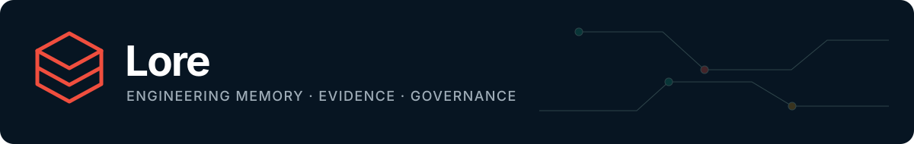
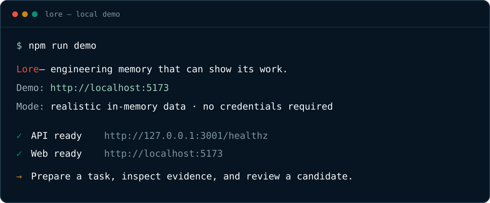

<p align="center">
  <a href="../README.md"></a>
</p>

<p align="center">
  <a href="../README.md"><strong>Project home</strong></a> ·
  <a href="features.md"><strong>Features</strong></a> ·
  <a href="onboarding.md"><strong>Setup</strong></a> ·
  <a href="authentication-and-organisations.md"><strong>Accounts</strong></a> ·
  <a href="github.md"><strong>GitHub</strong></a> ·
  <a href="security.md"><strong>Security</strong></a>
</p>

# Lore documentation

Start with the path that matches what you want to do. The demo is intentionally the first path: it teaches the product without asking for PostgreSQL, Redis, GitHub, or an AI key.

## Pick your path

| I want to… | Start here | What you will finish with |
| --- | --- | --- |
| See Lore working | [One-command demo](#one-command-demo) | A realistic local UI and a verified API/web runtime |
| Understand every product capability | [Feature guide](features.md) | Screenshots, inputs, outputs, usage, and limitations for each feature |
| Use Lore in a real checkout | [Onboarding](onboarding.md) | A local graph, task context, and a safety report |
| Set up login, profiles, teams, roles, and invitations | [Authentication and organisations](authentication-and-organisations.md) | A real GitHub identity and private multi-organisation account |
| Import GitHub history with a PAT | [GitHub integration](github.md) | A selected-repository, read-only historical import |
| Connect a coding agent | [MCP guide](mcp.md) | Deterministic Lore tools available to the agent |
| Understand the internals | [Architecture](architecture.md) | Runtime, storage, queue, analysis, and trust-boundary model |
| Operate or extend the project | [Development](development.md) · [API](api.md) | Local services, checks, endpoints, and contributor workflow |
| Review data and security risk | [Security](security.md) · [AI safety](ai-safety.md) | Product security and model boundaries |
| Consider external deployment | [SaaS readiness](saas-readiness.md) | Explicit privacy, PCI, tenant, policy, and assurance gates |

## One-command demo

From the repository root:

```bash
npm run demo
```

The script checks Node/npm, installs packages when needed, forces the safe in-memory demo mode, and starts the API and web interface. Open [http://localhost:5173](http://localhost:5173) and stop it with <kbd>Ctrl+C</kbd>.

To prove the same path without leaving services running:

```bash
npm run demo:check
```

<p align="center">
  
</p>

## Product journey

Lore follows one explainable loop:

1. **Observe evidence** from local code structure, bounded Git history, merged PRs, reviews, tests, documents, and run output.
2. **Propose knowledge** as a typed, scoped candidate with citations and a server-calculated confidence explanation.
3. **Require human approval** before a candidate becomes active organisational knowledge.
4. **Prepare task context** from relevant code, bounded impact, applicable policy, historical decisions, tests, and known unknowns.
5. **Observe the change** through a local session or agent wrapper.
6. **Verify independently** against the final Git diff and produce a durable safety report.

The [feature guide](features.md) explains each step with working screenshots and commands.

## Concept guides

| Topic | Guide |
| --- | --- |
| What counts as knowledge, evidence, scope, confidence, and lifecycle | [Knowledge model](knowledge-model.md) |
| How entity graphs and bounded change impact work | [Impact engine](impact-engine.md) |
| Why model output cannot directly become policy or mutate stores | [AI safety](ai-safety.md) |
| Why particular architectural trade-offs were chosen | [Decisions](decisions.md) |
| How requirements map to implementation and tests | [Acceptance map](acceptance.md) |
| What is executable in the current tree | [Capability inventory](capabilities.md) |
| How `.ideas2` was checked and split into delivery slices | [Compatibility roadmap](roadmap.md) |

## Deployment guides

| Mode | Use it for | Guide |
| --- | --- | --- |
| In-memory demo | Product exploration and screenshots | [Feature guide](features.md#one-command-demo) |
| Local checkout | Private AST/Git analysis and agent context | [Onboarding](onboarding.md#connect-a-local-checkout) |
| Local persistent stack | PostgreSQL, Redis, worker, and GitHub import | [Onboarding](onboarding.md#choose-a-mode) |
| Local GitHub login | Personal accounts, profiles, organisations, roles, and invitations | [Authentication setup](authentication-and-organisations.md#real-github-login-on-a-local-machine) |
| GitHub PAT | One-person, selected-repository evaluation | [GitHub PAT setup](github.md#recommended-first-run-local-fine-grained-pat) |
| GitHub App | Installation credentials and signed webhooks | [GitHub App setup](github.md#github-app-mode) |
| External SaaS | Not currently approved | [SaaS readiness gates](saas-readiness.md) |

## Documentation conventions

- Commands are written from the Lore repository unless a section says “from the target repository.”
- `OWNER/NAME`, UUIDs, paths, and secrets are placeholders unless they match the bundled demo values explicitly.
- Demo screenshots are captured from the working in-memory product, not static mockups.
- Security claims distinguish implemented controls from future deployment requirements.
- Brand usage, assets, palette, voice, and screenshot rules live in the [brand guide](brand.md).
