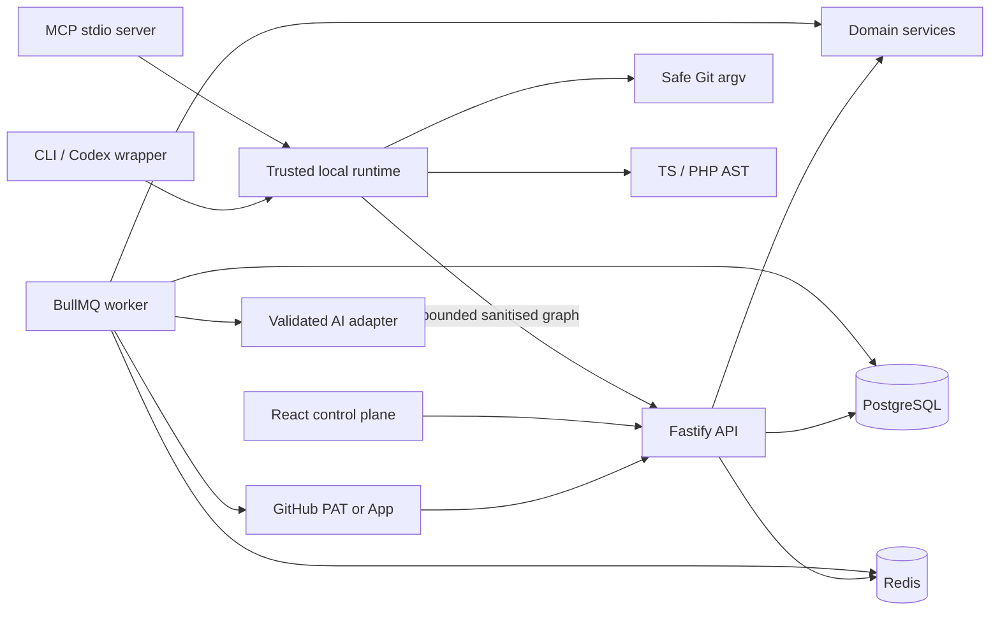
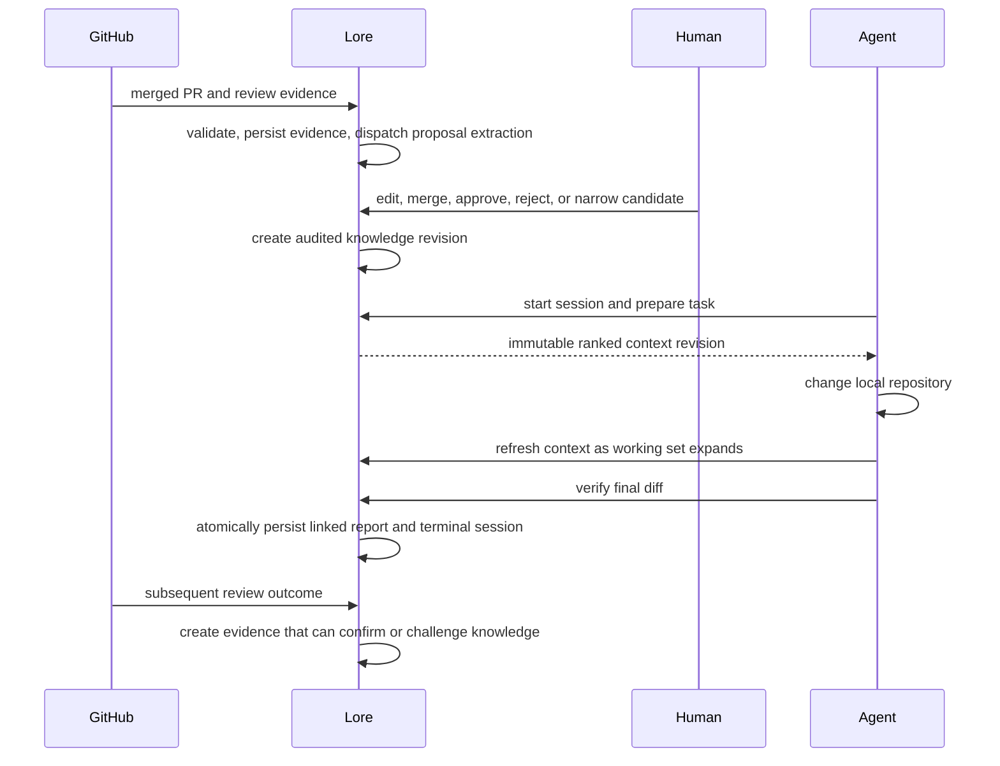

  

  <a href="../README.md"><strong>Project home</strong></a> ·
  <a href="README.md"><strong>Documentation</strong></a> ·
  <a href="features.md"><strong>Features</strong></a> ·
  <a href="onboarding.md"><strong>Setup</strong></a>

# Lore architecture

Lore is a strict-TypeScript modular monolith with five executable surfaces around one deterministic domain core. It is runnable on one machine while keeping the trust boundary required for a later private-node/control-plane split.

The browser cannot choose a server filesystem path. A local CLI indexes its own checkout and uploads only bounded entity/relationship metadata in service mode. Optional server-side indexing is disabled unless the stored path resolves beneath an owner-controlled `LORE_ALLOWED_REPOSITORY_ROOTS` entry.

## Executable surfaces

- `apps/api` authenticates, revalidates membership, applies CSRF to cookie writes, validates HTTP input, and calls application services.
- `apps/worker` performs trusted-path indexing, local PAT or installation-scoped App imports, proposal extraction, and knowledge-health jobs. Credentials are resolved in the worker and never travel in queue payloads.
- `apps/cli` provides explicit local, demo, and service authority plus machine-readable output.
- `apps/mcp` exposes narrow read/query/verify tools to coding agents using the checkout's explicit authority.
- `apps/web` is the human control plane for onboarding, candidates, knowledge, policies, repositories, and reports.

Domain behaviour lives in `packages/*`. PostgreSQL is the durable source of truth in persistent mode. Redis coordinates jobs but is not durable product state. The in-memory store is an explicit demo adapter, never a service failure fallback.

## Closed-loop lifecycle

Context records are immutable revisions. Session events are append-only and monotonically sequenced. Verification requires persisted context, captures a bounded `ChangeObservation` manifest without duplicating raw patches, and atomically links the observation, report, context revision, base/current commits, and completed session. An interrupted wrapper records an abandoned terminal event instead of a successful report.

## Adapter boundaries

| Boundary       | Interface               | Current adapter                                               |
| -------------- | ----------------------- | ------------------------------------------------------------- |
| Source control | `SourceControlProvider` | local fine-grained GitHub PAT, GitHub App, and safe local Git |
| Code analysis  | `LanguageAnalyzer`      | TypeScript/JavaScript AST and PHP parser                      |
| Work items     | `WorkItemProvider`      | GitHub issues-compatible seam                                 |
| AI             | `AIProvider`            | deterministic mock plus validated provider seam               |
| Persistence    | `LoreStore`             | Prisma/PostgreSQL and explicit in-memory demo                 |
| Jobs           | `JobDispatcher`         | BullMQ and explicit in-memory test/demo adapter               |

## Identity and tenancy

Runtime-created durable IDs are canonical UUIDs. Deterministic UUIDs are used where an external identity must map idempotently to a row; random UUIDs identify new human/runtime records. Friendly identifiers exist only inside the in-memory fixture and are translated during the demo seed.

Every persistent read and mutation carries an organisation boundary. An authenticated identity is insufficient on its own: active membership is revalidated on every product route. GitHub webhook routing additionally requires the stored App installation, provider repository ID, and owner/name to match the signed payload. PAT mode is intentionally a local, on-demand bootstrap path and has no webhook receiver identity.

## Runtime modes

- **Web/API demo:** seeded in-process state, selected explicitly by `DEMO_MODE=true`. Simulated jobs say so.
- **Persistent service:** PostgreSQL and Redis are authoritative; dependency failure makes readiness fail.
- **CLI/MCP local:** checkout-only AST/Git knowledge, with no organisational or fixture injection.
- **CLI/MCP demo:** bundled scenario, selected explicitly with `lore init --mode demo`.
- **CLI/MCP service:** API-backed knowledge, context, sessions, and reports plus local source analysis.

No surface silently falls back between modes. The web has explicit loading, connected, and disconnected states.

## Non-negotiable invariants

1. Every persistent object is organisation-scoped.
2. Observations and evidence never become active knowledge by side effect.
3. AI produces proposals only; deterministic validators own mutations.
4. Policies require human provenance and can never be auto-promoted.
5. Knowledge is revised, challenged, or superseded, never silently overwritten.
6. Context is ranked, scope-compatible, bounded, and includes its reason and evidence.
7. Git commands use argument arrays with no shell interpolation; diffs and status reads are bounded.
8. Repository text is untrusted data, including content that resembles instructions.
9. Durable lifecycles are replay-safe and observable; simulated work is never labelled completed.
10. Raw source remains at the trusted repository node unless retention is deliberately enabled for bounded evidence.

See [security](security.md), [API](api.md), [knowledge model](knowledge-model.md), [impact engine](impact-engine.md), and [design decisions](decisions.md).

The customer-managed node and multi-tenant control-plane boundary is a roadmap design, not a shipped security claim. Its production gates are tracked in [SaaS readiness](saas-readiness.md).
