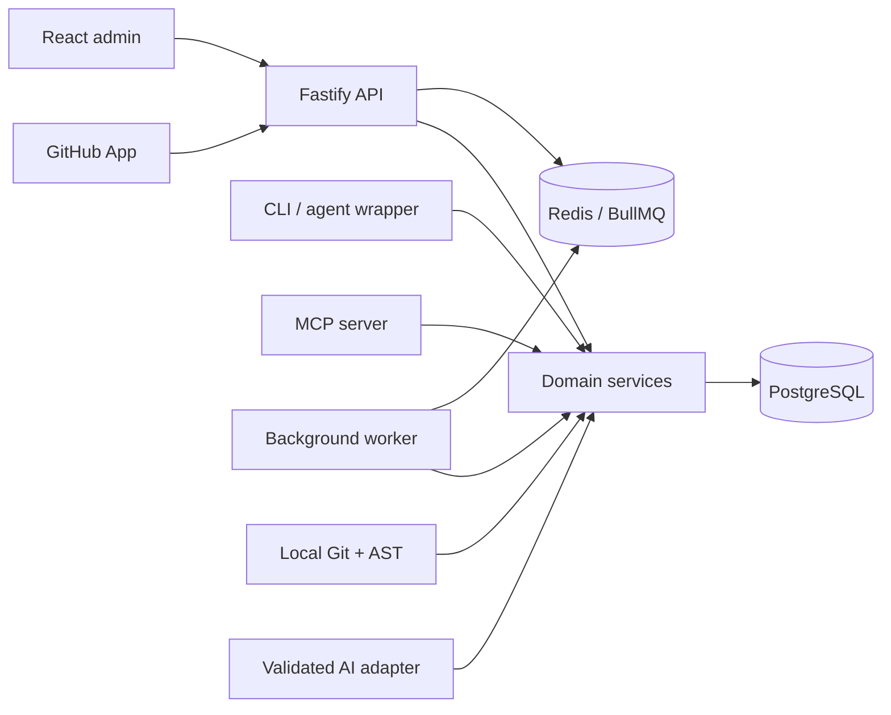
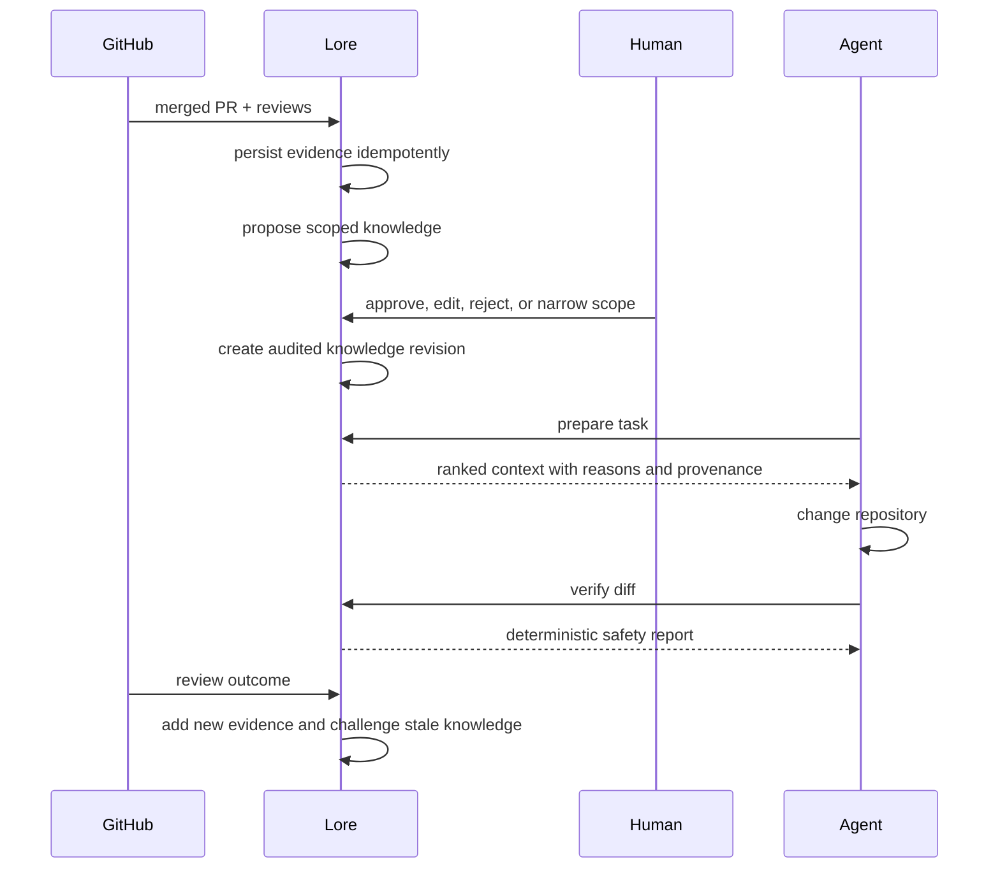

# Lore architecture

Lore is a modular monolith with five executable surfaces around one deterministic domain core.

The five apps are deliberately thin:

- `apps/api` validates HTTP input, applies tenant context, and calls application services.
- `apps/worker` runs repository indexing, imports, extraction, and knowledge-health jobs.
- `apps/cli` gives developers a local-first workflow and machine-readable `--json` output.
- `apps/mcp` exposes concise read/query tools to coding agents.
- `apps/web` is the human control plane for onboarding, candidates, policies, and reports.

Domain behaviour lives in `packages/*`. PostgreSQL stores the durable model; repository source can remain on a local filesystem. Redis is coordination infrastructure, never the source of truth.

## The working vertical slice

## Boundaries

| Boundary | Interface | Current adapter |
| --- | --- | --- |
| Source control | `SourceControlProvider` | GitHub App / local Git |
| Code analysis | `LanguageAnalyzer` | TypeScript/JavaScript AST and PHP parser |
| Work items | `WorkItemProvider` | GitHub issues-compatible boundary |
| AI | `AIProvider` | mock provider plus validated provider seam |
| Persistence | `LoreStore` | in-memory demo store and Prisma schema |
| Jobs | `JobDispatcher` | BullMQ |

## Non-negotiable invariants

1. Every persistent object is organisation-scoped.
2. Observations and evidence never become active knowledge by side effect.
3. AI produces proposals only. Deterministic validators own mutations.
4. Policies require human provenance and can never be auto-promoted.
5. Knowledge is revised, challenged, or superseded; never silently overwritten.
6. Context is ranked and bounded. A reason for inclusion accompanies every item.
7. Git commands use argument arrays with no shell interpolation.
8. Repository text is untrusted data, including text that resembles instructions.

## Runtime modes

- **Demo mode** uses seeded, in-process data so the full UI, CLI, and API can be explored without credentials.
- **Local stack** runs PostgreSQL, Redis, API, worker, and web through Docker Compose.
- **Local node** points analysis at a checked-out repository and retains raw source locally.

This split lets a single developer run Lore today without baking a cloud-only source-storage assumption into the product.

