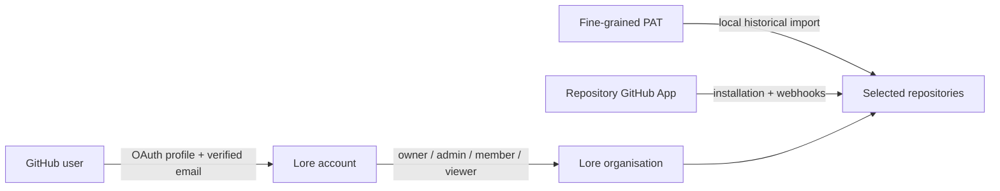

<p align="center">
  <a href="../README.md"></a>
</p>

<p align="center">
  <a href="../README.md"><strong>Project home</strong></a> ·
  <a href="README.md"><strong>Documentation</strong></a> ·
  <a href="github.md"><strong>GitHub integration</strong></a> ·
  <a href="saas-readiness.md"><strong>SaaS readiness</strong></a>
</p>

# Authentication, profiles, and organisations

Lore uses GitHub to prove who a person is, then creates its own short-lived, revocable browser session. A Lore account is personal. Engineering memory remains private inside organisations the account owns or has joined.

This page is the complete local setup guide. No payment system is required.

## The three GitHub credentials are different

| Purpose | Setting | Required locally? | What it can access |
| --- | --- | --- | --- |
| **Sign a person in** | `GITHUB_OAUTH_CLIENT_ID` and `GITHUB_OAUTH_CLIENT_SECRET` | Yes for real login; no for the demo account | The signed-in user's public profile and verified email |
| **Import old pull requests locally** | `GITHUB_TOKEN_PATH` or `GITHUB_TOKEN` | Only when importing real history | Repositories selected for that PAT |
| **Receive webhooks / shared repository access** | `GITHUB_APP_ID`, private key, and webhook secret | No | Repositories where the GitHub App is installed |

Signing in does **not** give Lore access to the user's repositories. A PAT or repository GitHub App is configured separately. This separation lets a person belong to an organisation without silently granting that organisation access to every repository they can see.



## Fastest option: try the complete account UI

```bash
npm run demo
```

Open [http://localhost:5173](http://localhost:5173), then choose **Explore the demo account**. The demo includes the login screen, profile, organisation switcher, member management, invitations, and role UI. It needs no GitHub credentials, database, or Redis. Demo accounts and changes disappear when the API stops.

## Real GitHub login on a local machine

GitHub can redirect a browser back to `localhost`; the application does not need to be publicly deployed. Only inbound webhooks require a public HTTPS endpoint.

### 1. Create a GitHub OAuth App

Open GitHub **Settings → Developer settings → OAuth Apps → New OAuth App**. For a local Vite/API setup enter:

```text
Application name:              Lore local
Homepage URL:                  http://localhost:5173
Authorization callback URL:   http://localhost:5173/api/auth/github/callback
```

Register the application, copy its Client ID, then generate a Client Secret. GitHub displays a new client secret only once; place it in `.env`, never in a committed file, screenshot, ticket, or chat transcript.

Lore uses GitHub's web application authorization-code flow, a random state value, PKCE with `S256`, and an exact callback URL. See GitHub's official [OAuth authorization guide](https://docs.github.com/en/apps/oauth-apps/building-oauth-apps/authorizing-oauth-apps) and [OAuth App security guidance](https://docs.github.com/en/apps/oauth-apps/building-oauth-apps/best-practices-for-creating-an-oauth-app).

### 2. Configure `.env`

```dotenv
DEMO_MODE=false
APP_URL=http://localhost:5173
WEB_ORIGIN=http://localhost:5173

SESSION_SECRET=replace-with-a-random-value-of-at-least-32-characters
AUTH_SESSION_TTL_HOURS=24

GITHUB_OAUTH_CLIENT_ID=Ov23liExample
GITHUB_OAUTH_CLIENT_SECRET=replace-with-the-generated-secret
GITHUB_OAUTH_CALLBACK_URL=http://localhost:5173/api/auth/github/callback
```

Generate a session secret locally:

```bash
openssl rand -base64 48
```

Use `localhost` consistently. Do not open the UI as `127.0.0.1` while the callback and `APP_URL` use `localhost`, because cookies are host-bound.

### 3. Start persistence and apply the schema

GitHub accounts, profiles, organisations, memberships, invitations, and sessions are durable PostgreSQL records.

```bash
npm install
npm run setup:check
npm run db:migrate
npm run dev
```

Open [http://localhost:5173](http://localhost:5173) and choose **Continue with GitHub**. The Vite development server proxies `/api/auth/github/callback` to the local API, so the callback URL above works without a public deployment.

If the rest of Lore is running in persistent mode, start its worker separately:

```bash
npm run worker
```

The worker is required for imports and indexing, not for signing in or editing an account.

## What happens on first login

1. Lore sends the browser to GitHub with `read:user user:email`, state, and a PKCE challenge.
2. GitHub returns a one-use code. Lore validates the signed browser transaction and exchanges the code server-side.
3. Lore fetches `/user` and `/user/emails`, and requires a verified GitHub email. GitHub documents the email endpoint in [List email addresses for the authenticated user](https://docs.github.com/en/rest/users/emails).
4. The account is linked to GitHub's stable numeric user ID. A GitHub login can be renamed; it is not used as the durable identity key.
5. Name, avatar, bio, company, location, website, GitHub login, and GitHub profile URL seed the profile.
6. The GitHub access token is discarded. Lore stores no GitHub login token and cannot use login to read repositories later.
7. Lore places only a random opaque value in the browser cookie. Its SHA-256 hash, expiry, last-seen time, revocation state, user, and selected organisation are stored server-side.

If an existing Lore account has the same verified email, the GitHub identity is linked to it. User-edited profile fields are not overwritten by later logins.

## Personal profiles

Open the avatar or **Your profile** in the sidebar. A user can edit:

- display name;
- job title and company;
- location and timezone;
- website;
- bio.

The verified email, GitHub login, and GitHub profile link remain identity information. Changing those requires a fresh, verified GitHub identity flow rather than an untrusted text field.

The **Account security** section lists active Lore sessions, their last activity and expiry, and lets the user revoke every other session. **Sign out** revokes the current server-side session immediately.

## Organisations and privacy

A new user with no memberships sees organisation onboarding. They can:

- create a private organisation and become its owner;
- accept an invitation sent to their verified GitHub email;
- later create more organisations;
- switch organisations from the top bar;
- keep one personal account across every organisation.

The selected organisation is part of the server-side session, not a browser-supplied tenant ID. Switching rotates the session token. Every product request validates that the user still has a current membership before reading organisation data.

### Roles

| Role | Read organisation data | Create/change engineering memory | Invite and manage members | Change organisation settings |
| --- | ---: | ---: | ---: | ---: |
| **Owner** | Yes | Yes | Yes | Yes |
| **Admin** | Yes | Yes | Yes, except ownership | Yes |
| **Member** | Yes | Yes | No | No |
| **Viewer** | Yes | No | No | No |

An owner cannot be demoted or removed through member management. Ownership transfer and organisation deletion are intentionally not exposed yet; adding them requires a deliberate, re-authenticated recovery flow.

### Invitations

1. Open **Organisation → Invite a colleague**.
2. Enter their work email and choose admin, member, or viewer.
3. Copy the generated link and send it through an approved channel.
4. The recipient signs in with GitHub.
5. Lore shows the invitation only when GitHub confirms the exact verified email.
6. Accepting it creates the membership and switches the active organisation.

The link is convenient routing, not the authority to join. Possessing it is insufficient: the authenticated, verified email must match. Invitations expire after seven days and can be revoked from the organisation screen. Lore currently provides copyable links but does not send email; transactional email is a later operational integration.

## Session and request security

- Session tokens contain no user ID, role, email, or organisation data.
- Only token hashes are stored in PostgreSQL.
- Sessions expire after `AUTH_SESSION_TTL_HOURS` (minimum 1, maximum 720; default 24).
- Tokens rotate after login, organisation creation, organisation switching, and invitation acceptance.
- A removed membership stops authorising tenant requests even if the browser still has a cookie.
- Cookies are `HttpOnly`, `SameSite=Lax`, signed, and `Secure` in production.
- Production cookie-authenticated mutations use CSRF protection.
- Sensitive headers, cookies, keys, and token-shaped fields are redacted from structured logs.
- Viewer write attempts fail at the API boundary, not only in the interface.

OWASP recommends opaque, meaningless session identifiers, server-side session state, regeneration after privilege changes, expiration, and revocation. Lore follows that model; see the [OWASP Session Management Cheat Sheet](https://cheatsheetseries.owasp.org/cheatsheets/Session_Management_Cheat_Sheet.html) and [OAuth 2.0 Cheat Sheet](https://cheatsheetseries.owasp.org/cheatsheets/OAuth2_Cheat_Sheet.html).

## Local development bypass

`LOCAL_DEV_AUTH=true` remains available for API/CLI development where a browser OAuth round-trip is undesirable. It is restricted to a loopback `APP_URL` and requires existing database user and organisation IDs:

```dotenv
LOCAL_DEV_AUTH=true
LOCAL_USER_ID=existing-user-uuid
LOCAL_ORGANISATION_ID=existing-organisation-uuid
LOCAL_USER_NAME=Local Developer
```

Do not enable it in shared, preview, staging, or production environments. GitHub sign-in is the supported human login path.

## Troubleshooting

### GitHub sign-in is not configured

Set both `GITHUB_OAUTH_CLIENT_ID` and `GITHUB_OAUTH_CLIENT_SECRET`, then restart the API. The login screen deliberately stays unavailable when only one is set.

### Callback says state is invalid or expired

Start again from Lore, finish within ten minutes, and use the same browser and host. A second login attempt, cleared cookies, or changing between `localhost` and `127.0.0.1` invalidates the first transaction.

### GitHub says the callback URL is incorrect

The OAuth App callback and `GITHUB_OAUTH_CALLBACK_URL` must both be exactly:

```text
http://localhost:5173/api/auth/github/callback
```

### Lore requires a verified email

Verify an email in GitHub account settings and allow the requested `user:email` scope. Lore does not accept an unverified profile email for identity linking or invitation acceptance.

### A user cannot see an invitation

Compare the invitation email with the verified email returned by their GitHub account. Revoke and recreate an incorrectly addressed invitation. Lore intentionally does not allow an owner to override this check from the browser.

### Old cookie stops working after switching organisation

That is expected. Organisation changes rotate and revoke the old session token. Refresh the active tab; close stale tabs if they continue showing a signed-out state.

## SaaS boundary

This implementation supplies a real account, profile, session, organisation, invitation, and baseline RBAC foundation. It does **not** by itself make Lore ready for an external multi-tenant SaaS launch. Enterprise SSO/SAML, MFA policy enforcement, SCIM, support access, installation ownership binding, immutable audit export, tenant cryptographic isolation, deletion/export, operational monitoring, incident response, legal documents, DPIA, PCI scope decisions, and independent penetration testing remain launch gates.

Do not deploy externally until the relevant controls in [SaaS readiness](saas-readiness.md) are implemented, tested, independently reviewed, and approved for the intended customer data.
