<p align="center">
  <a href="../README.md"></a>
</p>

<p align="center">
  <a href="../README.md"><strong>Project home</strong></a> ·
  <a href="README.md"><strong>Documentation</strong></a> ·
  <a href="onboarding.md"><strong>Setup</strong></a> ·
  <a href="github.md"><strong>GitHub</strong></a>
</p>

# Feature guide

This guide explains what every user-facing Lore feature does, what data it uses, how it works, how to exercise it, and where its current boundary lies. All screenshots below come from the runnable local demo.

## One-command demo

**What it does.** Starts a realistic Lore organisation, a 120-repository discovery fixture, graph, knowledge registry, candidate queue, reviewer directory, sessions, and safety reports without external services or credentials.

**How it works.** `scripts/lore-demo.sh` verifies Node.js 22+, installs dependencies only when missing, forces `DEMO_MODE=true`, disables GitHub credentials, and starts the Fastify API plus Vite UI. Demo writes stay in memory and reset when the API stops.

```bash
npm run demo
```

Open [http://localhost:5173](http://localhost:5173), choose **Explore Lore**, then **Explore the demo account**. For an automated readiness proof:

```bash
npm run demo:check
```

<p align="center">
  
</p>

**Boundary.** The repository picker, imports, and queued jobs use development fixtures or simulated outcomes. Use persistent mode for token-visible GitHub repositories, real history, durable knowledge, Redis jobs, and multi-process workers.

## Public product page and focused sign-in

**What it does.** Gives unauthenticated visitors a standard product-led introduction to Lore while keeping authentication short and purposeful. The public page explains the product promise, evidence workflow, major capabilities, governance model, local-first path, documentation, and security material. It uses real Lore screens so feature claims can be inspected rather than inferred from decorative mockups.

**How it works.** An unauthenticated request to `/` renders the public product page with one semantic heading, descriptive sections, crawlable links, social metadata, responsive layouts, descriptive screenshot alternatives, and a `robots.txt` policy. **Explore Lore** and **Sign in** lead to `/signin`. An authenticated session bypasses both public surfaces and renders the organisation workspace directly.

<p align="center">
  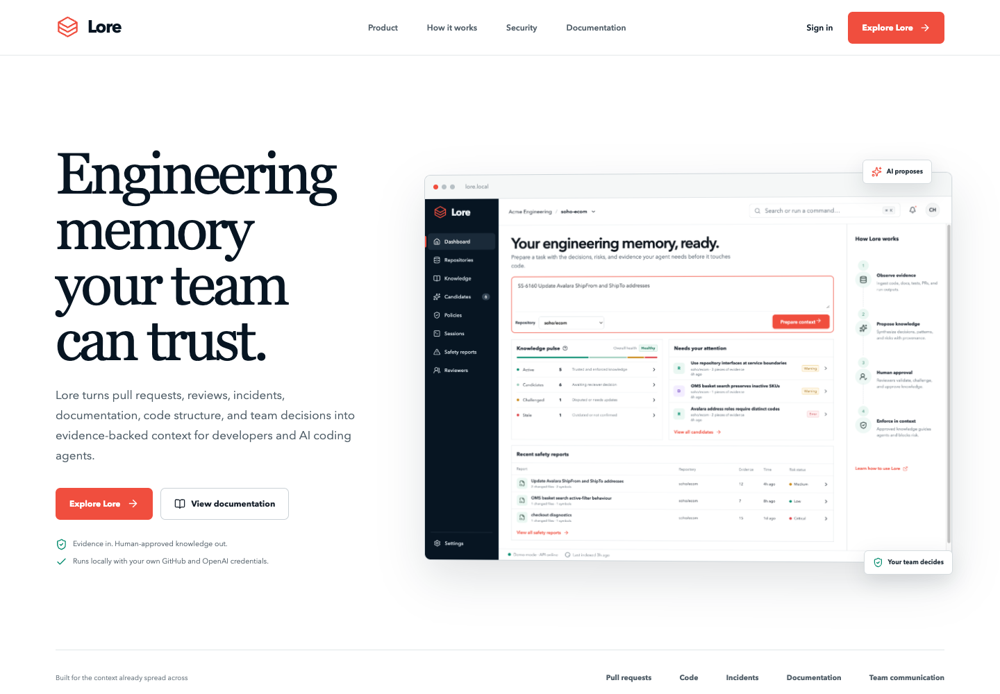
</p>

**Use it.** Open [http://localhost:5173](http://localhost:5173) without a session and follow **Explore Lore**. Shared mode offers **Continue with GitHub**. Demo mode offers **Explore the demo account**. Full local PAT mode establishes the workstation user automatically and enters the private workspace without making OAuth a local requirement.

<p align="center">
  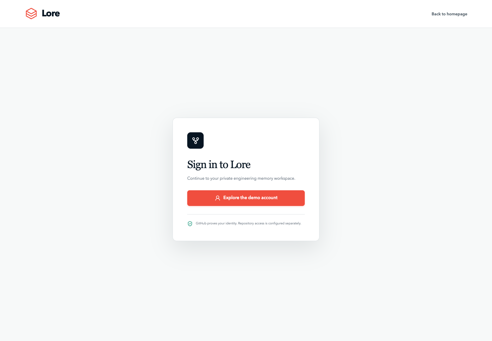
</p>

**SEO boundary.** The current Vite client application supplies static title, description, robot, Open Graph, and Twitter metadata plus semantic rendered content. A public SaaS launch should add the final canonical production URL, an absolute social preview image, sitemap generation, and server rendering or prerendering once the public domain is known.

## GitHub identity, personal profiles, and organisations

**What it does.** Gives every person one account with a GitHub-seeded, editable profile. The account can own or join multiple private organisations, switch between them, invite colleagues, and enforce owner, admin, member, or viewer access.

**How it works.** Full local mode uses one server-side PAT to read the GitHub profile and automatically establish the loopback user/workspace. Shared/SaaS mode uses GitHub’s authorization-code flow with state and PKCE, then issues a random Lore session. Both link the stable numeric GitHub identity and persist scoped users, profiles, organisations, roles, and preferences. Every tenant request validates current membership.

**Use it locally.** Set `GITHUB_TOKEN`, run `npm run local:up`, and open [http://localhost:5173](http://localhost:5173). No callback is required; the profile and first private workspace are created automatically. The demo account remains available through `npm run demo`.

Open the avatar or **Your profile**. GitHub supplies the first name, avatar, bio, company, location, website, login, profile link, and verified email. Display name, bio, company, title, location, website, and timezone are editable; later logins preserve user edits. The security section lists expiring sessions and can revoke every other session or sign out the current one.

<p align="center">
  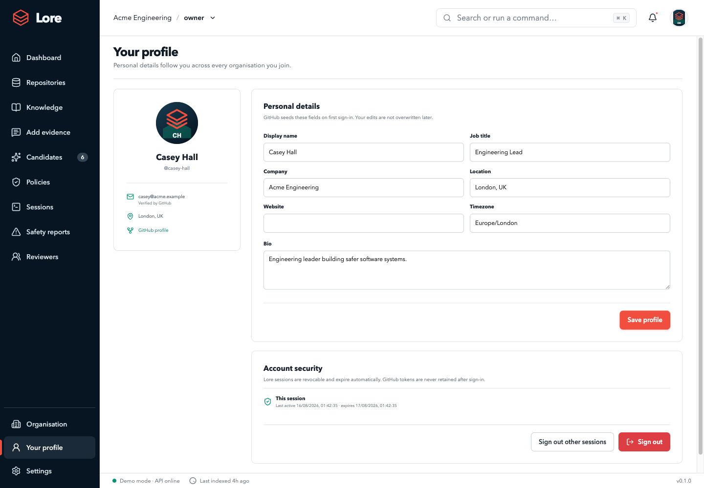
</p>

Open **Organisation** to create or switch workspaces, inspect members, invite a verified email as admin/member/viewer, copy its join link, change non-owner roles, revoke invitations, or remove non-owner members. Invitation links alone grant nothing: acceptance requires a signed-in GitHub account with the exact verified invited email.

<p align="center">
  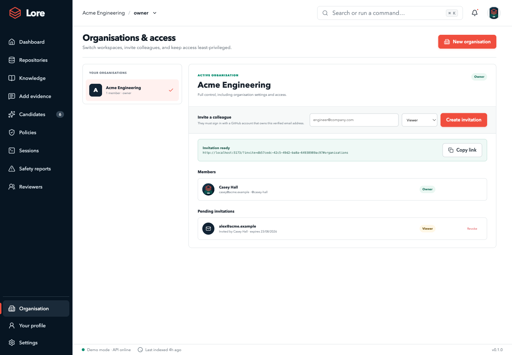
</p>

**Role boundary.** Owners manage everything. Admins manage settings, people, and engineering memory but cannot replace the owner. Members can work with repositories and engineering memory. Viewers are API-enforced read-only. Ownership transfer and organisation deletion intentionally wait for a re-authenticated recovery design.

**Repository boundary.** Local mode deliberately uses the same PAT for profile and repositories because one trusted user owns the loopback process. Shared/SaaS mode separates OAuth identity from GitHub App repository installations.

## Personal and organisation settings

**What it does.** Separates preferences that follow a user from defaults that belong only to the active organisation.

**How it works.** Personal start page, import limit, theme, onboarding, and notices are stored on the user. Automatic GitHub import, initial limit, recurring interval, AI extraction, communications, member repository access, MCP access, and retention defaults are stored on the organisation. Owners/admins can change organisation settings; members/viewers cannot.

**Use it.** Open **Settings & setup**. The same screen truthfully reports local versus SaaS deployment, full versus demo product mode, persistence, jobs, GitHub readiness, AI provider/model, login mode, and MCP authority. Saving automatic-sync changes updates existing repository schedulers.

<p align="center">
  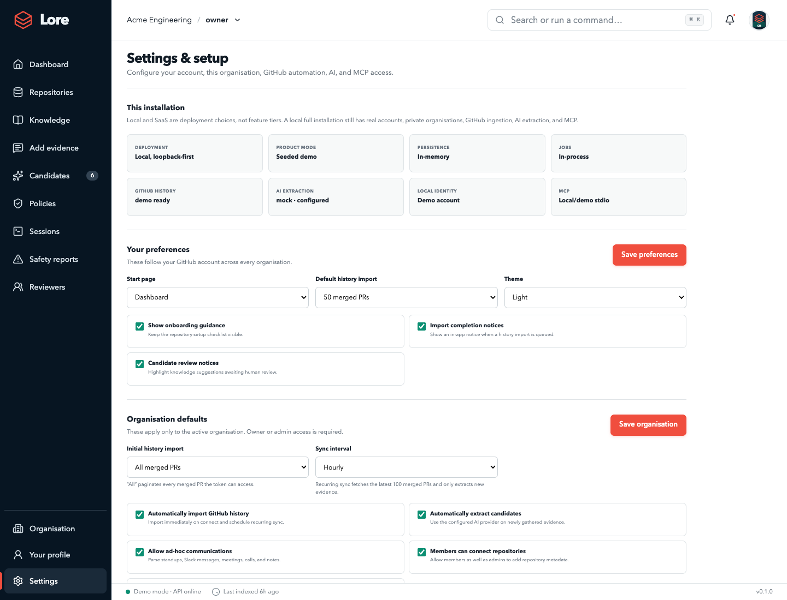
</p>

**SaaS boundary.** This is a working local account and baseline tenancy foundation, not an external-hosting approval. Enterprise SSO/MFA/SCIM, final granular roles, support access, audit export, installation ownership verification, deletion/export, regulated-data controls, legal materials, and independent testing remain in [SaaS readiness](saas-readiness.md).

## Dashboard and knowledge pulse

**What it does.** Gives reviewers one operating view of knowledge health, pending candidates, recent verification results, and the task-context entry point.

**How it works.** The API returns an organisation-scoped snapshot. The UI calculates active, challenged, stale, and candidate totals from that snapshot and links each attention row to the relevant review surface.

**Use it.** Run the demo and open **Dashboard**. Select a repository, describe a task, and choose **Prepare context**.

<p align="center">
  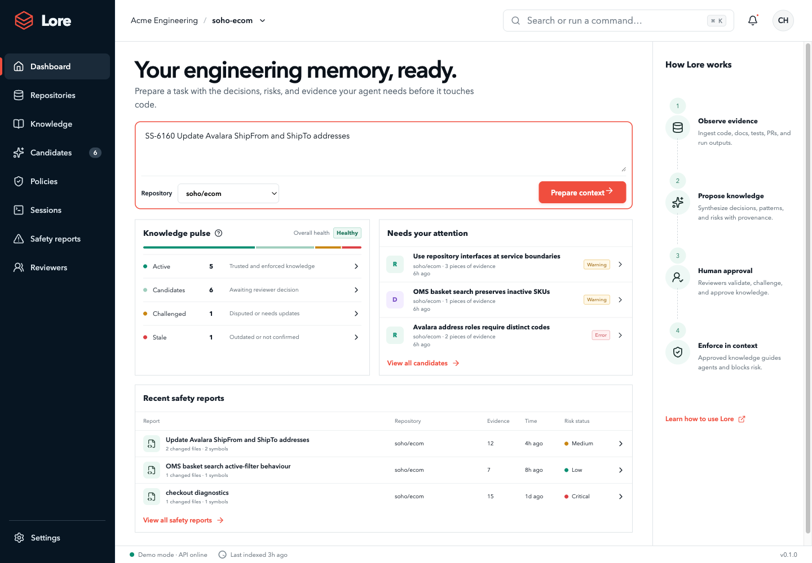
</p>

<details>
  <summary><strong>Responsive mobile dashboard</strong></summary>
  <br />
  <p align="center">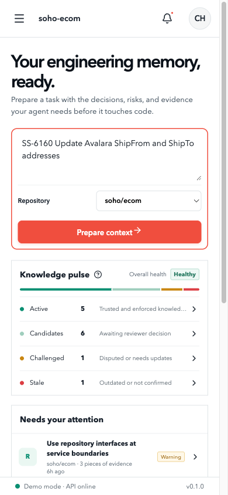</p>
</details>

## Task context preparation

**What it does.** Turns a task description into a bounded context package before an engineer or agent changes code.

**How it works.** Deterministic retrieval identifies matching files and symbols, traverses the impact graph within depth/node/confidence limits, resolves applicable policies and approved knowledge by scope, ranks evidence, recommends tests, and preserves unknowns. AI is not required for this path.

**Output.** Candidate files, affected areas, policies, rules, decisions, reviewer preferences, evidence citations, recommended tests, and explicit unknowns.

**Use it in the UI.** Enter a task on **Dashboard** and choose **Prepare context**.

<p align="center">
  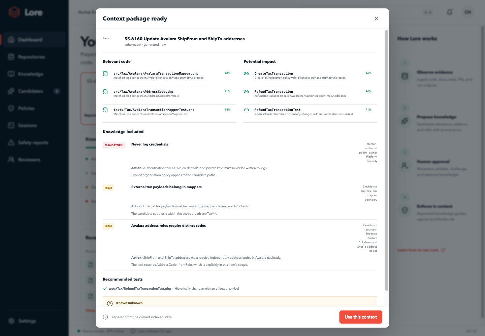
</p>

**Use it from a checkout.** From an initialised target repository:

```bash
lore prepare "TICKET-123 Update refund address mapping"
lore context
```

For automation, place `--json` before the command:

```bash
lore --json prepare "TICKET-123 Update refund address mapping"
```

## Repository connection, indexing, and retention

**What it does.** Connects provider identity and local source structure without asking the browser to read a filesystem checkout.

**How it works.** In local mode, the UI loads every repository the PAT can read and stores each selected provider ID, owner/name, default branch, status, and retention configuration under the active organisation. Search and bulk selection are client-side over the paginated GitHub result; a batch API connects up to 500 repositories idempotently and reports connected, duplicate, and already-connected outcomes. Trusted local CLI analysis uploads only the sanitised entity/relationship graph in service mode. Raw source stays local.

**Use it.** Open **Repositories → Connect repositories**, search by owner/name/description, check individual repositories or **Select results**, then connect the selection. Repeat for another organisation or a token-visible account larger than 500 repositories. Each successful connection automatically queues history and recurring sync when organisation automation is enabled.

<p align="center">
  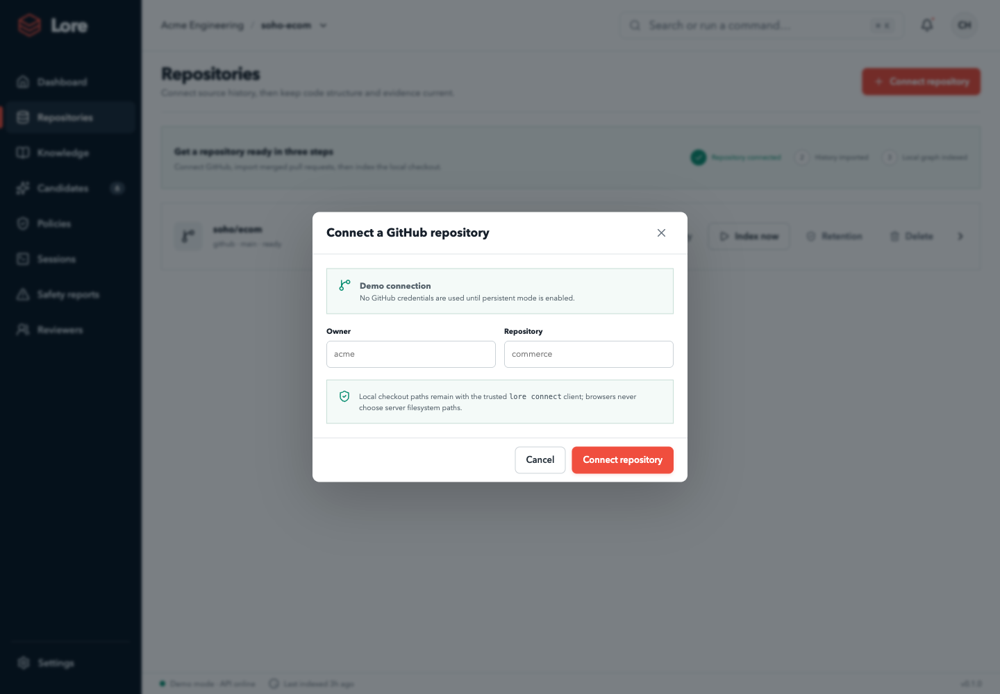
</p>

From the target checkout:

```bash
lore init --repository OWNER/NAME --organisation ORGANISATION_SLUG
lore index
```

To bind that checkout to a persistent Lore repository:

```bash
lore connect OWNER/NAME
lore index
```

**Retention.** Configure summary-only storage, review-comment retention, raw patch retention, and source-snippet retention before importing. Repository deletion requires typing the exact `owner/name` and removes repository-scoped evidence, graph, sessions, reports, candidates, policies, and knowledge.

## GitHub history import

**What it does.** Converts accepted repository history into evidence for candidate extraction and future context.

**How it works.** The local worker authenticates with the PAT and paginates merged PRs plus submitted review bodies, inline review comments, PR conversation comments, commits, changed paths, and optional bounded patches. Stable provider IDs make ingestion idempotent. Connecting queues the organisation’s complete initial import by default and installs an hourly latest-100-PR scheduler. Only new or upstream-edited evidence is sent to AI; edits append immutable evidence revisions.

**Use it.** Follow the [GitHub guide](github.md), set `GITHUB_TOKEN`, configure organisation retention/import defaults, then select one or many repositories in Lore. Manual bounded or complete imports remain available at any time.

## Local AST and Git impact graph

**What it does.** Builds structural context that prose search cannot reliably recover.

**How it works.** TypeScript/JavaScript and PHP adapters parse symbols and relationships. Bounded Git history contributes commit and statistically supported co-change edges. Traversal applies maximum depth, node count, confidence thresholds, and stable ordering.

```bash
lore index
lore impact AddressRoleCode::fromRole
lore explain AddressRoleCode::fromRole
```

The local graph is stored under owner-only `.lore/` state and excluded from verification. In service mode, only its bounded graph envelope is uploaded.

## Durable background activity

**What it does.** Makes GitHub imports, repository indexing, AI extraction, health checks, retries, and failures visible instead of hiding them inside a queue.

**How it works.** Before Redis dispatch, the API atomically creates a PostgreSQL job run, its first append-only event, and an outbox intent. Successful dispatch, worker attempts, retries, redacted and bounded error text, dead-letter outcomes, and scalar-only result summaries extend that lifecycle. If Redis is temporarily unavailable, the request reports `dispatch_pending`; a bounded reconciler retries due intents every 30 seconds and after API restart. Recurring scheduler occurrences acquire their own run when the worker starts them.

Open **Activity** to inspect organisation-scoped runs. The page refreshes every five seconds and stops its timer when it is not mounted.

<p align="center">
  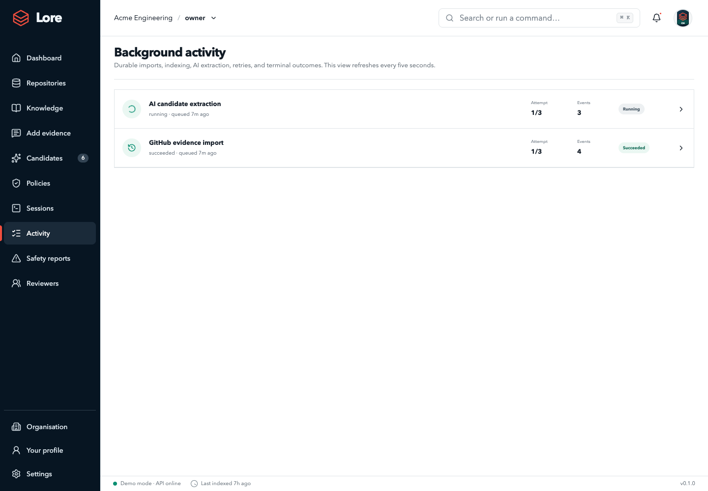
</p>

**Boundary.** The outbox payload never appears in the browser. Operator cancellation/manual replay, percentage progress, retention controls, and business-event-plus-outbox transactions are still tracked in the [roadmap](roadmap.md); the current implementation recovers the dispatch intent itself.

## Knowledge registry

**What it does.** Maintains typed engineering facts, decisions, rules, preferences, regressions, warnings, and policies with scope, confidence, health, and provenance.

**How it works.** Active knowledge is revisioned rather than overwritten. Contradictory or stale evidence challenges an item. Repository/path/symbol scope prevents a narrow rule from silently becoming organisation-wide authority.

<p align="center">
  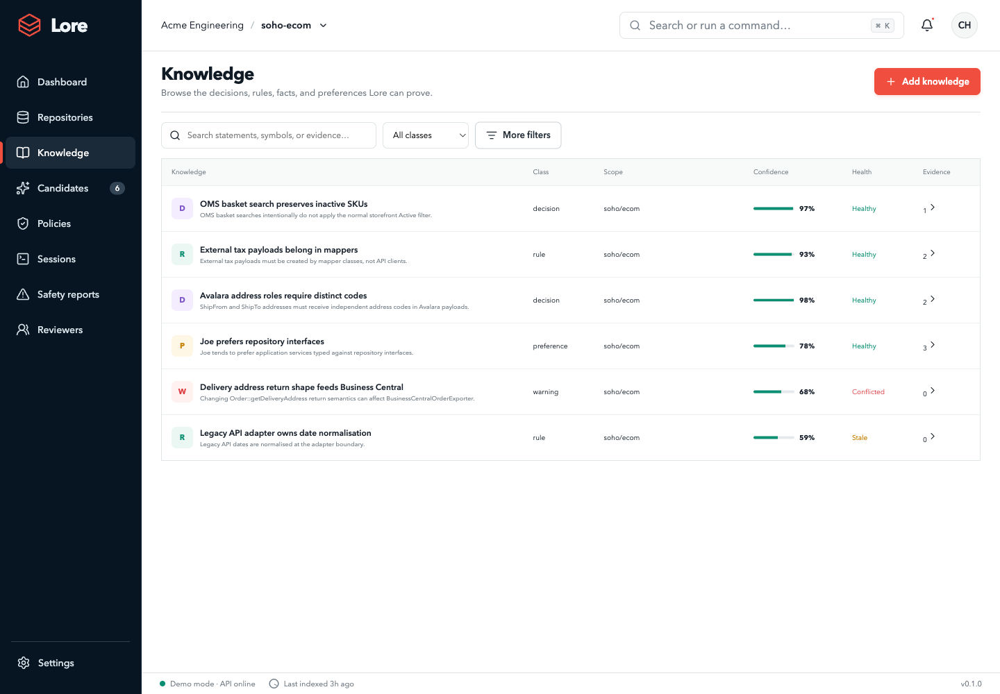
</p>

```bash
lore knowledge list
lore knowledge show KNOWLEDGE_UUID
lore knowledge export --format markdown --output lore-knowledge.md
lore knowledge import AGENTS.md
lore knowledge import docs/adr/0007-tax-boundary.md
```

Markdown imports split on headings and retain their source filename. They enter as explicit human confirmation, not model-generated certainty.

## Candidate review and human approval

**What it does.** Keeps extracted engineering knowledge advisory until a person verifies its statement, type, evidence, confidence, contradictions, and scope. AI-assisted triage makes a queue of hundreds practical without turning model output into authority.

**How it works.** Candidate confidence is calculated server-side from independent observations, PRs, reviewers, recency, explicitness, reliability, contradictions, human confirmation, scope stability, and current code match. GitHub extraction uses a bounded authored-content view: retained raw diffs, reusable PR-template checklists, compliance boilerplate, and link sections stay in the evidence record for audit but are excluded from the model input. Single-PR implementation facts, Git activity summaries, and AI-derived process policies fail validation instead of entering the review queue. A decision, rule, preference, warning, or regression from one pull request also needs an explicit authored signal of that kind; the changed code alone is not sufficient.

Choose **Triage with AI** for the current filters, or select rows and choose **Analyse selection**. Lore first applies deterministic quality, duplicate, contradiction, and possible-policy checks. Only ambiguous candidates are sent to the configured structured-output provider in batches of ten. Each model request contains the candidate, at most three bounded evidence excerpts, and at most five potential matches; it does not contain the repository archive. Triage is persisted with its model/prompt provenance and becomes stale when the candidate or linked evidence changes.

The result is one of **Ready to add**, **Likely noise**, **Edit first**, **Merge duplicate**, **Needs review**, or **Possible policy**. Use the summary cards, full-text search, repository/type/recommendation filters, priority/confidence/date sorting, 60-item pages, and row selection to work through a large queue. List refreshes carry only bounded evidence previews; opening one candidate loads its complete retained evidence on demand. Each detail view explains the recommendation, durability, policy fit, confidence, and reasons alongside the original evidence and server confidence.

**Guarded bulk review.** Select candidates, then use **Add to knowledge** or **Ignore**. Bulk add is offered only when AI returned a durable, unchanged recommendation at 90% or greater, Lore confidence is at least 72%, two or more evidence sources exist, and no contradiction exists. Bulk ignore is offered only for a 90% or greater one-off/situational recommendation with no possible-policy signal or contradiction. The confirmation shows the exact count; the server revalidates every item and safely skips stale or ineligible rows. Approval creates audited active revisions. Ignore removes queue noise but retains source evidence and audit history.

<p align="center">
  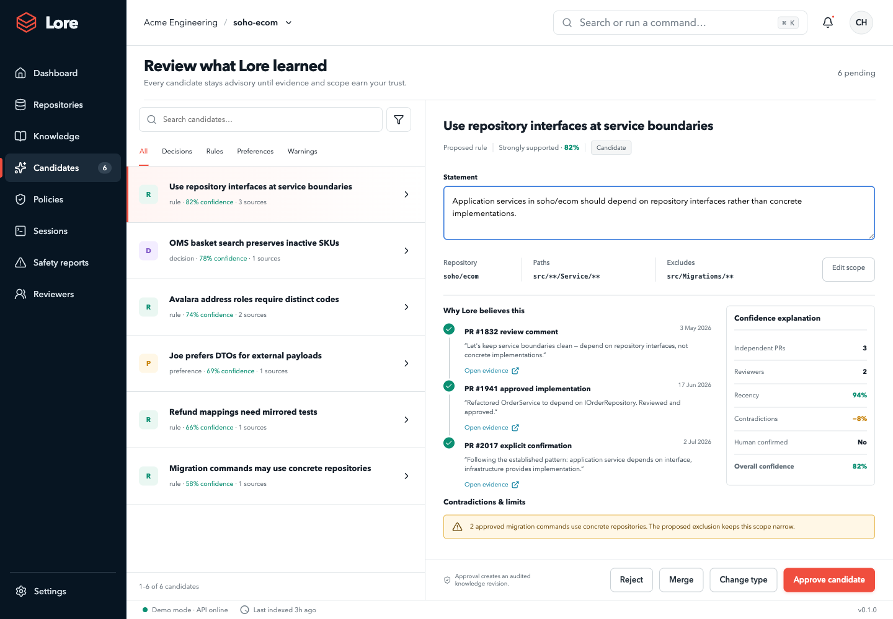
</p>

**Boundary.** Model output can propose a candidate and a triage recommendation but cannot approve/ignore/merge anything, create policy, calculate authority, or write directly to the knowledge store. Anything policy-like is routed to individual review because a real policy needs a human owner, severity, scope, and deterministic detector.

## Ad-hoc messages, calls, and standup transcripts

**What it does.** Captures engineering context that never appears in a pull request: a Slack request, an in-person decision, call notes, an email, or a complete standup transcript. Lore preserves the original communication as evidence and turns only explicit decision, rule, preference, fact, warning, or regression signals into review candidates.

**How it works.** Open **Add evidence**, choose the communication type and optional repository, add a title, paste the source text, and confirm that you are allowed to retain it. Lore sends the text through the same structured extraction, evidence validation, confidence, proposal, and candidate pipeline used for imported review evidence. The source is treated as untrusted data, so instructions inside a transcript cannot create policy or bypass validation. Full local mode uses the configured OpenAI structured-output adapter; the credential-free demo deliberately uses the deterministic mock provider.

<p align="center">
  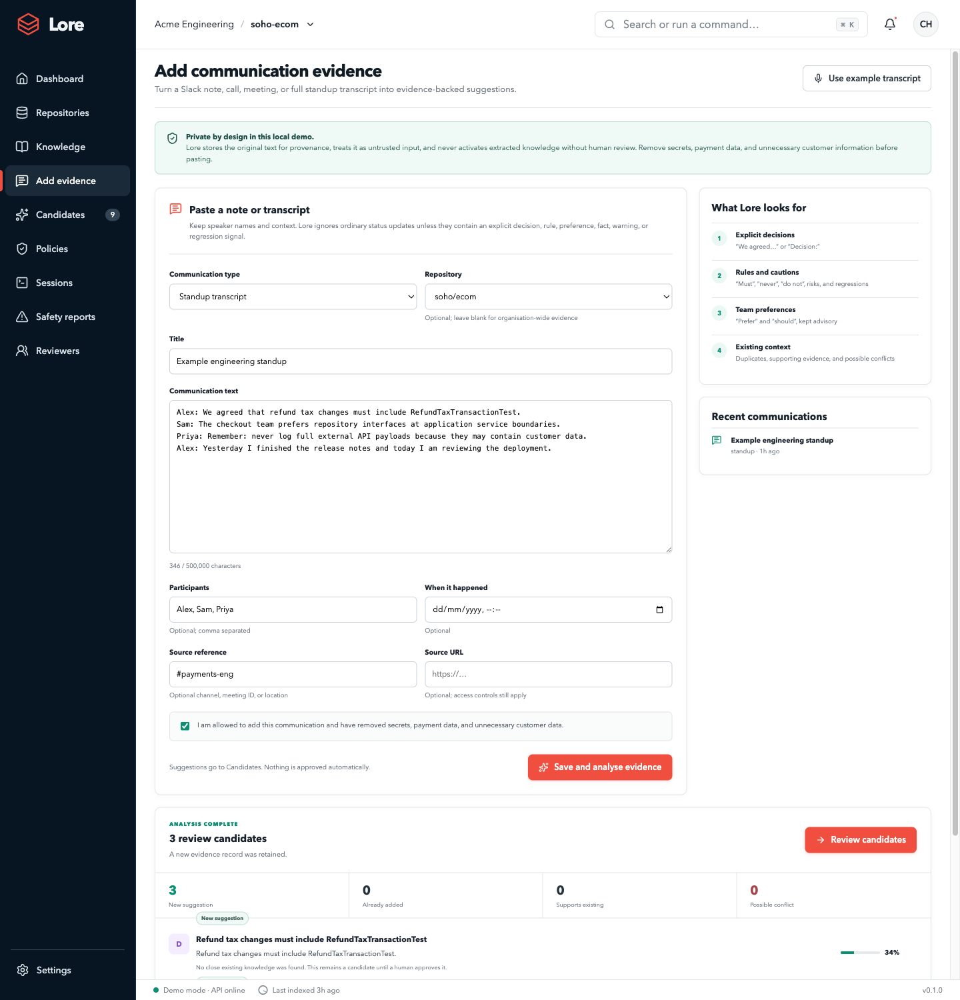
</p>

```text
Alex: We agreed that refund tax changes must include RefundTaxTransactionTest.
Sam: The checkout team prefers repository interfaces at application service boundaries.
Priya: Remember: never log full external API payloads because they may contain customer data.
Alex: Yesterday I updated the release notes.
```

The first three lines become a decision, preference, and rule candidate. The ordinary status update remains in the evidence transcript but does not become knowledge.

**Comparison outcomes.** Every suggestion is marked **New suggestion**, **Already added**, **Supports existing**, or **Possible conflict**. Matching knowledge is linked in the result so the reviewer can merge supporting evidence, reject duplicate wording, or investigate a conflict. Exact re-submission is idempotent.

**Human control.** Extracted wording can be corrected in **Candidates** before approval. Nothing from a communication becomes active knowledge automatically, and conversational evidence receives lower source-reliability confidence than independent reviewed PR evidence.

**Privacy boundary.** The original text is retained for provenance. Only paste communications you are authorised to store. Remove passwords, tokens, cardholder data, authentication data, and unnecessary customer or employee personal data first. Local demo storage resets on restart; persistent mode writes the text to PostgreSQL under the repository/organisation boundary. DLP, redaction, legal hold, and configurable raw-text retention are SaaS gates, not completed protections.

## Deterministic policies

**What it does.** Applies explicit human-owned rules such as forbidden secret logging, required tests, or path-specific review constraints.

**How it works.** Policies have owners, severity, scope, enabled state, and deterministic detectors. Verification evaluates changed paths and added patch lines rather than asking an AI model whether a rule passed.

<p align="center">
  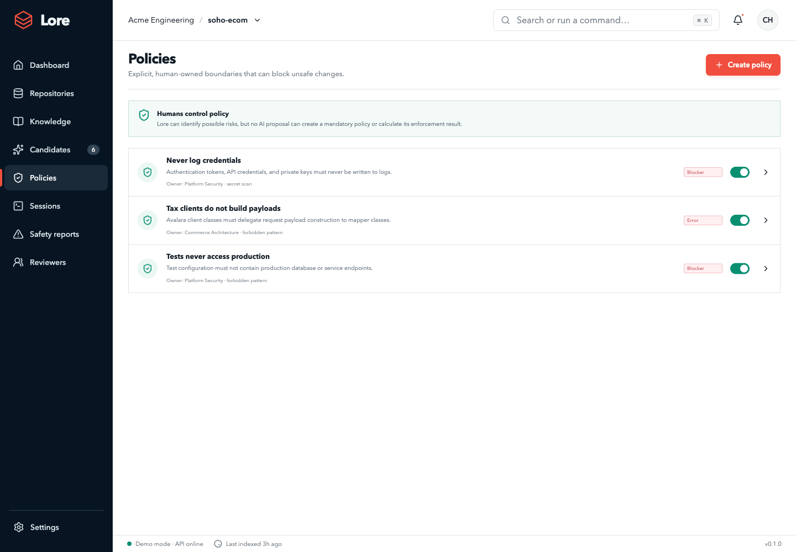
</p>

Policies can block completion; inferred preferences cannot silently promote themselves into mandatory enforcement.

## Agent sessions and change observation

**What it does.** Records who or what performed a task, the initial context, the changing file set, refreshes, and the terminal verification state.

**How it works.** The verified Codex wrapper prepares context, writes `.lore/LORE_CONTEXT.md`, observes changed paths, refreshes context when the working set expands, then verifies the final diff. Persistent verification records a bounded immutable manifest with per-patch hashes, the exact context revision, and base/current commits; it does not duplicate raw patches into the observation. Non-zero agent exits remain visible as abandoned sessions.

```bash
lore session start "Update refund address mapping" --agent codex
lore session status
lore session stop

lore agent codex "TICKET-123 Update refund address mapping"
```

<p align="center">
  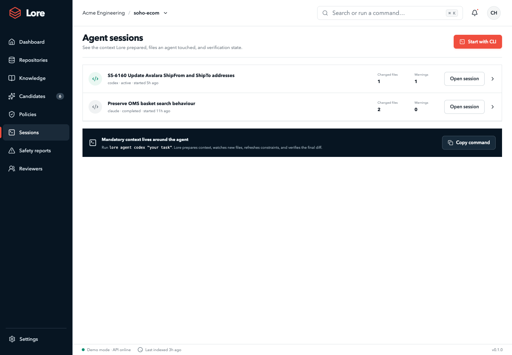
</p>

**Boundary.** The wrapper currently has one verified interactive adapter: Codex. Other agents use the same deterministic capabilities through MCP.

## Safety reports

**What it does.** Independently evaluates the final Git change and creates a durable evidence-backed completion report.

**How it works.** Lore discovers staged, unstaged, renamed, deleted, and untracked changes; maps changed paths/symbols into bounded impact; resolves policy and regression evidence; identifies related tests; and separates blockers, warnings, passes, and unknowns.

```bash
lore verify
lore --json verify
```

<p align="center">
  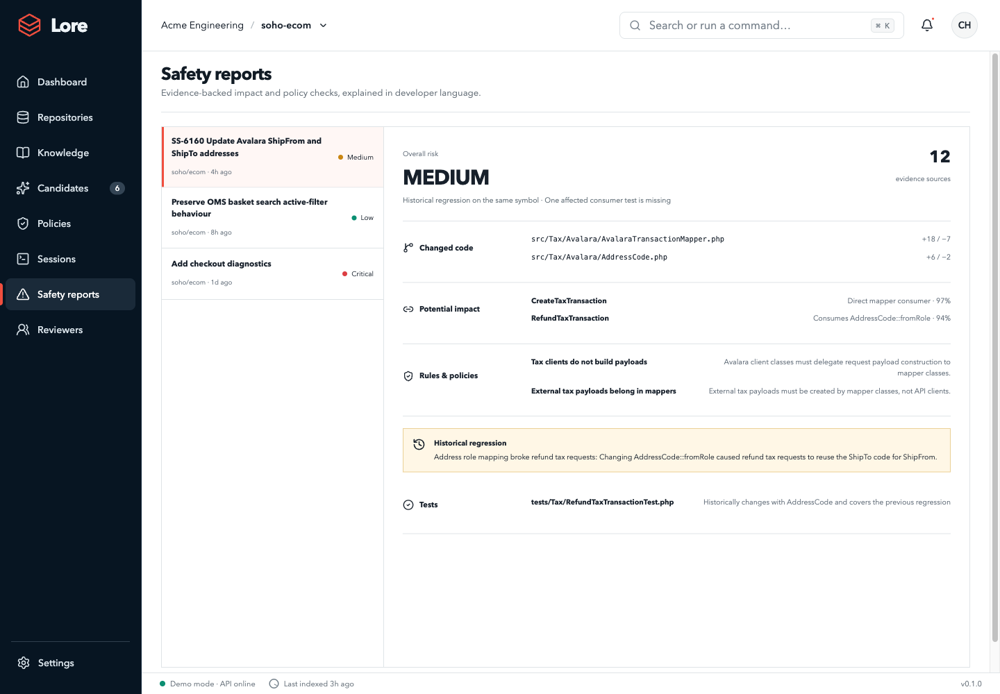
</p>

Passing a report is not a claim that no defect exists. It means the implemented deterministic checks found no unresolved blocker in the evidence and scope available to that run.

## Reviewer knowledge and routing

**What it does.** Preserves evidence-backed review expertise and preferences so a task can find relevant people and conventions.

**How it works.** Reviewer observations retain source PRs, scope, confirmation state, and confidence. Preferences remain advisory and can be challenged; they are not employee performance scores.

<p align="center">
  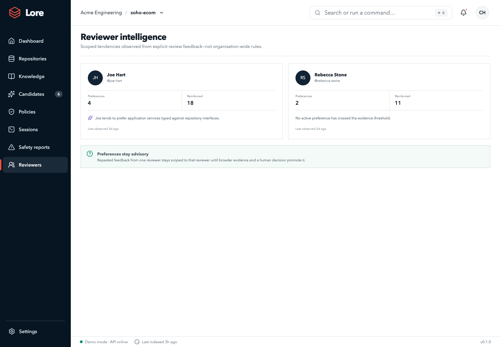
</p>

**Boundary.** Do not use reviewer inference for automated employment, promotion, retention, or task-allocation decisions. External deployment requires the privacy and AI-governance controls in [SaaS readiness](saas-readiness.md).

## MCP tools for coding agents

**What it does.** Exposes Lore’s deterministic retrieval and verification boundary over stdio MCP.

**Available tools.** `lore_prepare_task`, `lore_get_context`, `lore_search`, `lore_lookup_symbol`, `lore_find_history`, `lore_get_rules`, `lore_get_decisions`, `lore_get_impact`, `lore_verify_change`, `lore_explain`, and validation-only `lore_propose_knowledge`.

Build Lore and configure the absolute paths:

```json
{
  "mcpServers": {
    "lore": {
      "command": "node",
      "args": ["/absolute/path/to/Lore/dist/mcp.js"],
      "env": {
        "LORE_REPOSITORY_PATH": "/absolute/path/to/target/repository"
      }
    }
  }
}
```

Use preparation before edits and verification before completion. See the complete [MCP guide](mcp.md).

## Search and command palette

Press <kbd>⌘K</kbd> or <kbd>Ctrl+K</kbd> anywhere in the web app. The palette navigates product areas and keeps the UI usable on dense repositories. The same retrieval services back CLI/MCP search; product chrome never substitutes browser-only state for authoritative records.

## Security and data boundaries

- Browsers never submit local checkout paths.
- The local GitHub PAT is resolved only by the API/worker and never enters queue payloads, browser responses, PostgreSQL, or `.lore`; SaaS App keys remain server-side.
- Repository text, reviews, tickets, and model output are untrusted data.
- Git processes use argument arrays with `shell: false`; revisions and paths are validated and bounded.
- Organisation and repository ownership are checked at persistent store boundaries.
- Secret, cookie, token, and key-shaped log fields are redacted.
- AI is optional. Full local mode can use the OpenAI Responses API with schema-validated structured output; the demo uses deterministic mock data, and enforcement remains deterministic in both modes.

Read [Security](security.md), [AI safety](ai-safety.md), and [SaaS readiness](saas-readiness.md) before connecting sensitive customer repositories or exposing Lore externally.
