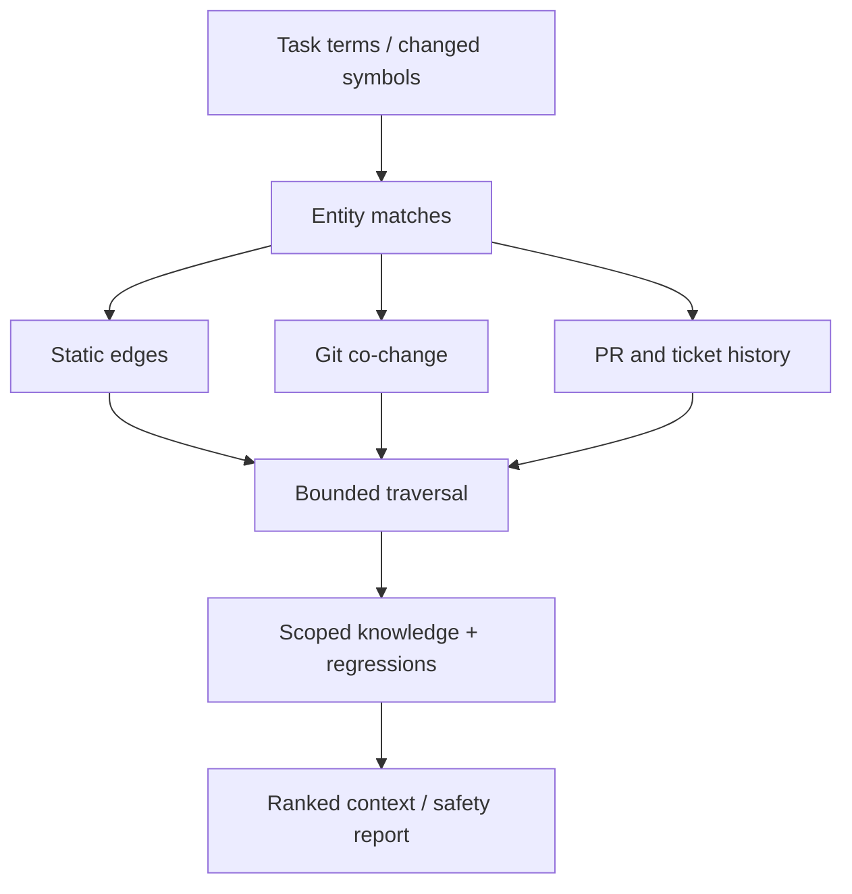

# Impact engine

Lore combines deterministic code structure with historical signals instead of treating semantic similarity as dependency.

Static calls, imports, inheritance, and test links receive the strongest weight. Well-sampled co-change relationships are medium/high. Shared tickets and AI-inferred semantics are supporting signals only.

Traversal always applies `maxDepth`, `maxNodes`, a minimum confidence, and optional relationship filters. A one-of-one co-change is deliberately weak; Wilson scoring prevents tiny samples from appearing certain.

Verification calculates risk from affected entities, public interfaces, policies, regressions, missing related tests, high-risk integrations, and graph distance. The returned level is `LOW`, `MEDIUM`, `HIGH`, or `CRITICAL`, with human-readable reasons.

