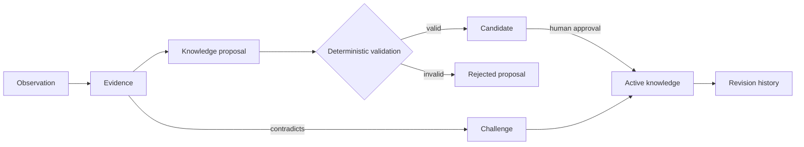

# Knowledge model

Lore separates what happened from what an organisation believes.

## Knowledge classes

- **Fact** — objectively true and normally discoverable.
- **Decision** — an intentional design or business choice.
- **Rule** — an engineering expectation.
- **Preference** — a person or team's repeated tendency.
- **Inference** — a useful but unconfirmed interpretation.
- **Policy** — an explicitly owned boundary, never AI-created.
- **Regression** — a historical failure tied to affected code.
- **Warning** — a scoped risk that should be surfaced.

## Scope

Scope is structured JSON and may combine organisation, repository, paths, symbols, subsystem, language, framework, team, reviewer, integration, and ticket type. Narrow scope wins over broad scope, but conflicts are surfaced rather than erased.

## Promotion and confidence

Confidence is calculated server-side from supporting evidence, independent PRs and reviewers, recency, source reliability, explicitness, contradictions, stable scope, matching code, and human confirmation. The default bands are:

| Score | Label | Behaviour |
| --- | --- | --- |
| `< 0.40` | Weak candidate | Review only |
| `0.40–0.69` | Candidate | Advisory when directly relevant |
| `0.70–0.84` | Strongly supported | High-priority context |
| `0.85–0.94` | Strong | High-priority context |
| `>= 0.95` | Established | High-priority or mandatory by type |

Rules and decisions require stronger evidence than reviewer preferences. Policies always require explicit human approval.

## Evolution

Each change creates a `KnowledgeRevision`. Contradictory evidence creates a `KnowledgeChallenge`. Resolutions can confirm, modify, supersede, split scope, archive, or mark a false positive. Health checks lower freshness when evidence ages, code disappears, ownership changes, or recent accepted work contradicts the item.

